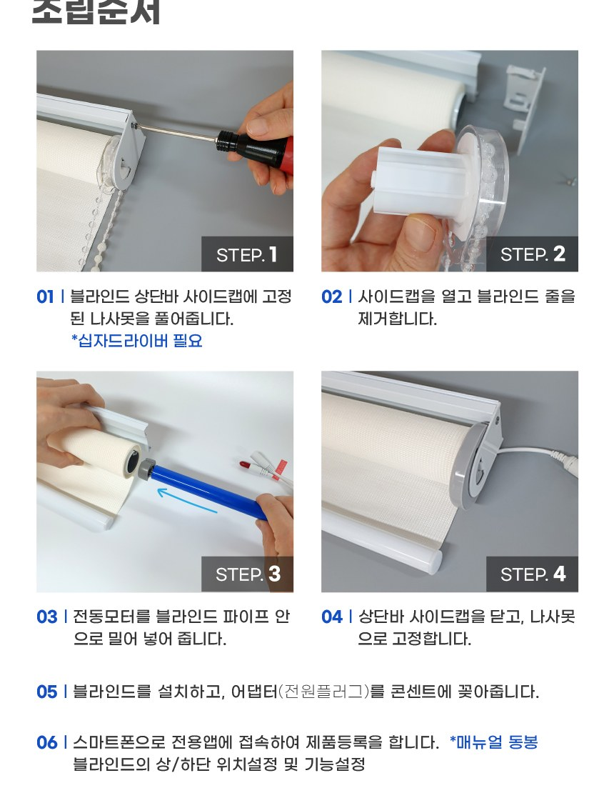

# 1. 시작하기

이지롤 스마트 블라인드를 구매해 주셔서 감사합니다. 이 설명서를 따라 하면 누구나 쉽게 설치하고 사용할 수 있습니다.

---

## 구성품 확인

- **전동모터 본체** · **전원 어댑터·케이블** · 설명서
- 리모컨은 **이지롤 플러스** 세트에 포함됩니다. (세트 구성에 따라 다를 수 있어요)

## 설치하기

십자드라이버 하나면 됩니다. 쓰시던 블라인드의 당김줄을 빼고 전동모터를 넣는 방식이에요.

---

## 전원을 켜면

전원을 연결하면 블라인드가 **살짝 움직였다가 제자리로 돌아옵니다.**
👉 고장이 아니라 **"정상 작동 중"이라는 인사 동작**입니다. 모터·전원이 정상이라는 뜻이에요.

## 기기 라벨 확인 (등록할 때 필요)

본체 라벨에 인쇄된 두 가지를 확인해 두세요.

| 라벨 항목 | 예시 | 용도 |
|---|---|---|
| 기기 이름 (ID) | `EZS17A......` | 앱 등록 시 WiFi 목록에 이 이름이 보임 |
| 비밀번호 (PW) | `0313......` | 그 WiFi에 접속할 때 입력 |

---

## 앱 설치하기

스마트폰에 **이지롤 앱**을 설치하세요.

| 스마트폰 | 설치 방법 |
|---|---|
| 안드로이드 | Google Play에서 "이지롤" 검색 → 설치 |
| 아이폰 | App Store에서 "이지롤" 검색 → 설치 |

---

## 회원가입 · 로그인

앱을 처음 열면 로그인 화면이 나옵니다. 편한 방법을 고르세요.

| 방법 | 설명 |
|---|---|
| **간편 로그인** | 구글 · 카카오 · 네이버 계정으로 바로 시작 (비밀번호 따로 안 만들어도 됨) |
| **이메일 가입** | 이메일 + 비밀번호로 직접 가입 |

✍️ (로그인 화면 스크린샷 — LoginRoute/Login, 소셜 버튼 보이게)

> 💡 처음 가입 시 **지역(국가)**을 선택합니다. 알람·시간 기능이 그 지역 시간에 맞춰 동작합니다.

로그인하면 다음 단계 — **블라인드를 앱에 등록**할 차례입니다.

---

다음 단계 → [2. 기기 등록하기](02_앱_등록하기.md)
