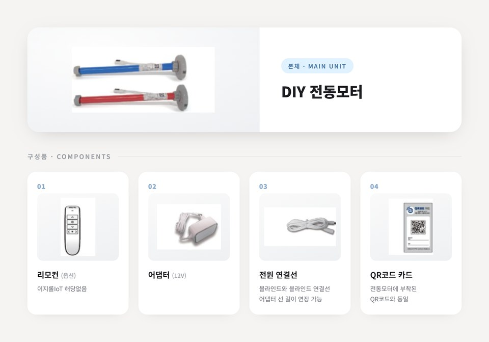

# 1. 시작하기

이지롤 스마트 블라인드를 구매해 주셔서 감사합니다. 이 설명서를 따라 하면 누구나 쉽게 설치하고 사용할 수 있습니다.

---

## 구성품 확인

| 구성 | 설명 |
|---|---|
| **본체 — DIY 전동모터** | 블라인드에 넣는 전동모터 본체 |
| **01 리모컨** (옵션) | 이지롤IoT 해당 없음 |
| **02 어댑터** (12V) | 전원 공급용 |
| **03 전원 연결선** | 블라인드와 블라인드 연결선 · 어댑터 선 길이 연장 가능 |
| **04 QR코드 카드** | 전동모터에 부착된 QR코드와 동일 — [앱 등록](02_앱_등록하기.md) 때 사용 |

---

## 조립 전, 모터가 정상인지 먼저 확인하세요

블라인드에 조립하기 **전에**, 전동모터가 정상 동작하는지 간단히 확인합니다.

1. 전동모터에 **어댑터(전원 연결선)** 를 연결합니다.
2. 어댑터를 **콘센트에 꽂습니다.**
3. 모터가 **좌우(위아래)로 조금씩 움직였다가 멈추면 → 정상입니다!**

👉 전원을 연결하면 모터가 **양쪽으로 아주 조금씩 회전하는 동작**을 합니다. 고장이 아니라 **"정상 작동 중"이라는 인사 동작**이에요.

!!! success "이 동작이 보이면 모터 자체에는 이상이 없습니다"

    이후 앱 등록이나 제어가 잘 안 된다면 모터 고장이 아니라 **WiFi·통신 문제**일 가능성이 큽니다. [문제해결 FAQ](06_문제해결_FAQ.md)를 참고하세요.

- **정상 확인 후에는 전원을 뽑고** [1-1. 설치 가이드 (조립)](install_guide.md)로 넘어가세요.
- **아무 반응이 없다면** 어댑터·연결선 연결을 다시 확인하고, 그래도 안 되면 [고객센터](06_문제해결_FAQ.md#그래도-해결이-안-되면)로 문의해 주세요.
