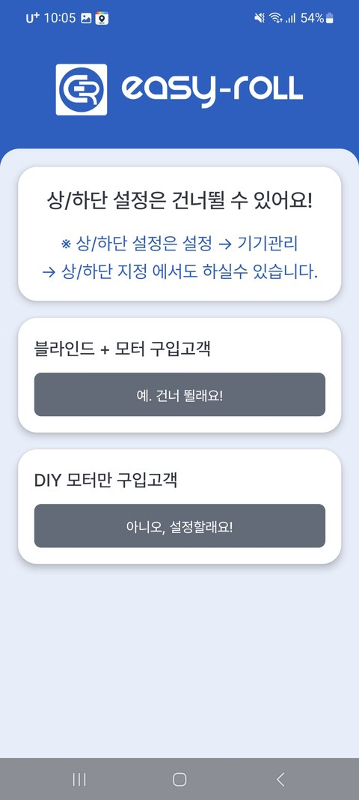
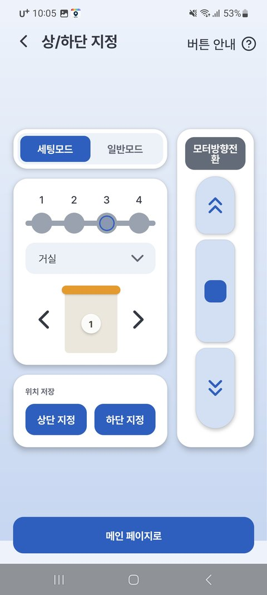

# 2-1. Upper/Lower Limit Setup

**Be sure to complete the Upper/Lower Limit Setup for your blind.**
This is the process of teaching the blind "how far up and how far down it should go." Only after this setup will it **move precisely to the position you want (%)**, and will **saved positions (M1–M3) and alarms** work correctly.

After registration, the guide screen below appears. Tap **[No, I'll set it up!]** to start right away.

{ width="300" }

!!! danger "Please read before you start"

    **In Setup Mode, the blind moves without any limit stops.**
    Be sure to press **■ Stop before it reaches the end.** If it keeps winding, the blind can be damaged, so please make sure you understand the steps below before proceeding.

### Setup Steps

1. Before setup, **lower the blind all the way down and then raise it back up.**
2. In **Setup Mode**, move the blind to your desired **"topmost"** position → **[Set Upper]**
3. Then move it to your desired **"bottommost"** position → **[Set Lower]**
    - ⚠️ **Always set the upper first, then the lower!**
4. If you have several blinds, use **◀ ▶** to switch between devices and repeat.

{ width="300" }

!!! tip "Good to know"

    - **To set it up later** — tap the **⚙ next to the zone name → [Zone Device Settings] → [Upper/Lower Limit Setup]**
    - **If the direction is reversed** — you can change it with **[Motor Direction]** on the screen.
    - **If you re-set the upper limit** — the lower limit and saved positions are **automatically adjusted along with it**. No need to set everything again.
