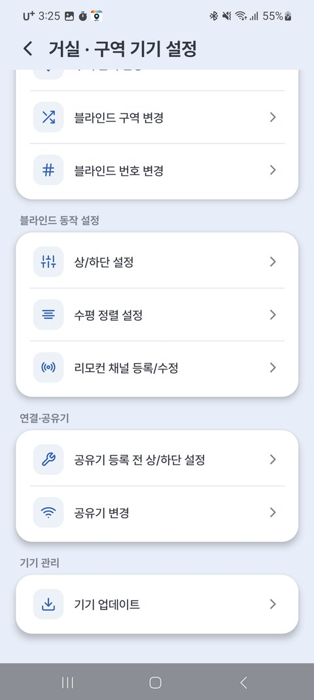

# 2-2. Change Zone & Number

Use this feature to **change the blind number** you set during registration, or to **move a blind to another zone**.

!!! tip "Nothing to change? Move on to the next step"

    If you'll use it just as registered, go straight to [3. Basic Usage](03_기본_사용법.md).

Tap the **⚙ (gear)** next to the zone name → **[Zone Device Settings]**, where all the organizing menus are gathered.

{ width="300" }

| Task | How | Example |
|---|---|---|
| **Change blind number** | Zone Device Settings → Change blind number | Living Room 1 / Living Room 2 |
| **Move to another zone** | Zone Device Settings → Change blind zone | Living Room → Bedroom |
| **Rename a zone** | ⚙ next to the zone name → Rename | "Zone 1" → "Living Room" |

