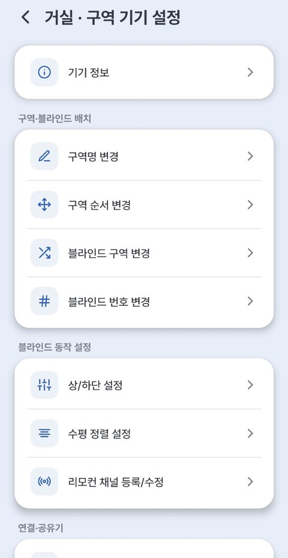

# 2-2. 구역·번호 변경

등록할 때 정한 **블라인드 번호를 바꾸거나**, **블라인드를 다른 구역으로 옮길 때** 사용하는 기능입니다.

!!! tip "변경할 내용이 없다면 다음 단계로 넘어가 주세요"

    등록한 그대로 사용하실 분은 [3. 기본 사용법](03_기본_사용법.md)으로 바로 가시면 됩니다.

구역 이름 옆 **⚙(톱니)** → **[구역 기기 설정]** 에 모든 정리 메뉴가 모여 있습니다.

{ width="300" }

| 정리 | 방법 | 예 |
|---|---|---|
| **블라인드 번호 변경** | 구역 기기 설정 → 블라인드 번호 변경 | 거실 1번 / 거실 2번 |
| **다른 구역으로 이동** | 구역 기기 설정 → 블라인드 구역 변경 | 거실 → 안방 |
| **구역 이름 바꾸기** | 구역 기기 설정 → 구역명 변경 | "구역1" → "거실" |

---

## 기기 정보 확인

같은 **[구역 기기 설정]** 의 **[기기 정보]** 에서 블라인드 하나하나의 상태를 볼 수 있습니다. 고객센터 문의나 [Home Assistant 연동](../ha/index.md) 때 필요한 값이 여기에 있어요.

| 항목 | 내용 |
|---|---|
| **펌웨어 버전** | 지금 설치된 기기 소프트웨어 버전 ([7. 기기 업데이트](09_기기_업데이트.md)) |
| **네트워크** | 기기 IP · 공유기 ID/IP · WiFi 신호 세기·채널 · MAC |
| **리모컨** | 등록된 리모컨 ID · 채널 |
| **Home Assistant** | 연결됨(브로커·계정) / 미사용 / 지원하지 않는 기기 |

