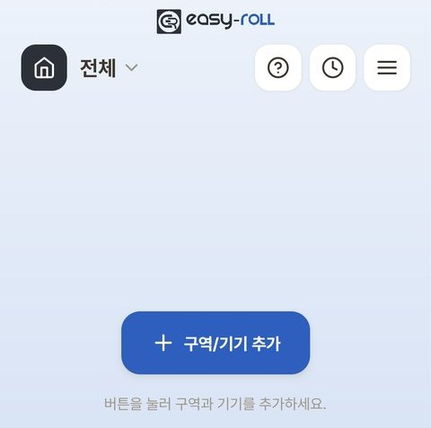
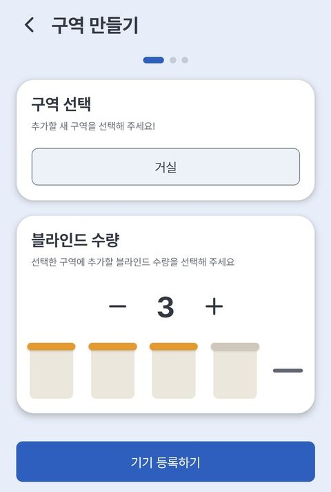
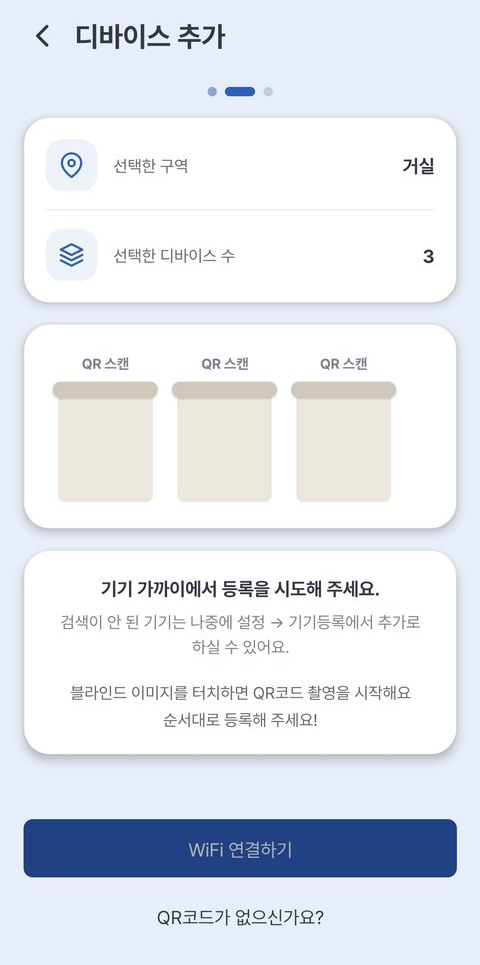
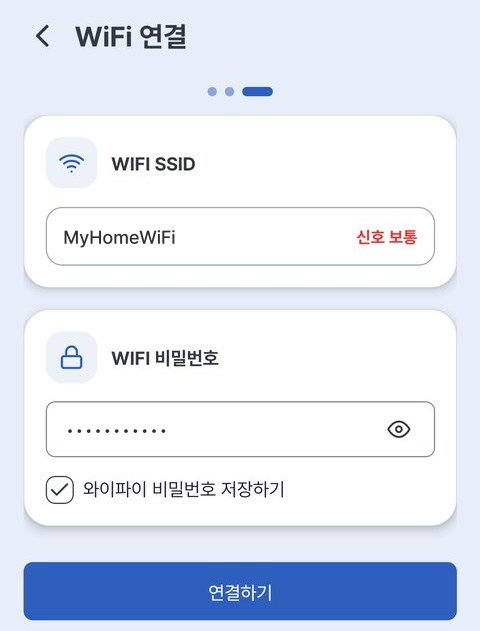
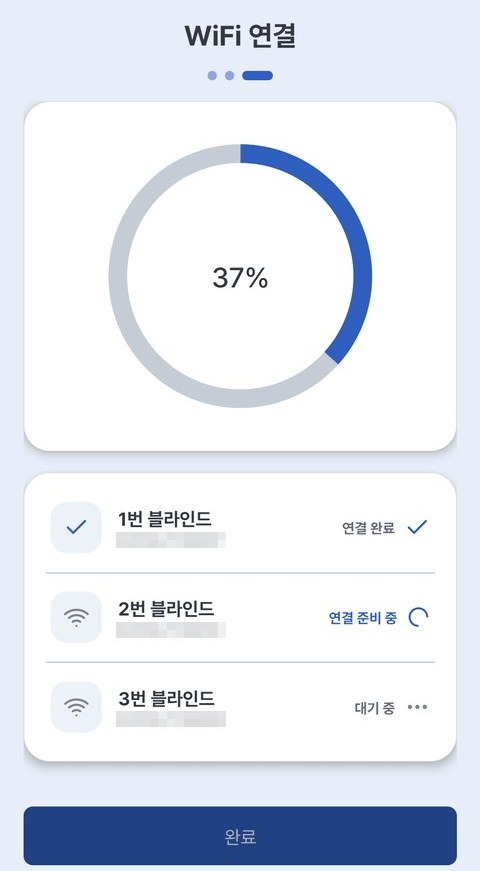
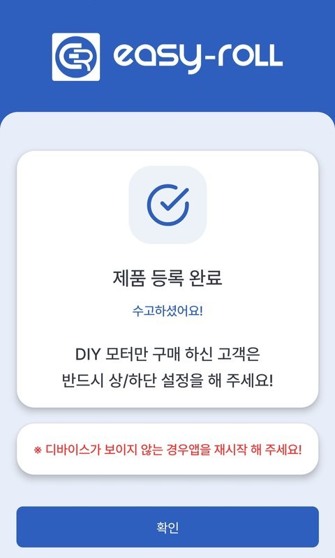

# 2. Register Device

This is the step where you connect your blind to your home Wi-Fi (router) and to the app. You only need to do it once. (About 3 minutes)

---

## What You'll Need

- The EasyRoll app, logged in (see [1-2. Installing the App & Signing Up](02_앱_설치_회원가입.md))
- Your **home Wi-Fi (router) name and password** (it must be 2.4GHz — see below)
- The blind's **QR code**

> ⚠️ **Check these before registering** (same as the in-app guidance)
>
> 1. Blinds connect to **2.4GHz** Wi-Fi only — if your router name ends in `...5G`, choose the one **without** the 5G.
> 2. Your router must have a **password set**.
> 3. **Turn off your phone's Bluetooth and smartwatch** while registering.
> 4. Don't keep Bluetooth devices close to the router.

---

## Registration Steps — Do Several at Once!

If you have multiple blinds, you can register them **all at once, one zone (room) at a time**.

**① Get started** — This is the first screen you see after logging in. Tap the **[+ Add zone/device]** button in the center to begin.

{ width="300" }

On the **[Add device]** screen, tap **[Add new zone]**. (To add blinds to a zone you already created, choose **[Add existing zone]** instead — it appears only once you have at least one zone.)

**② Create a zone** — Choose a zone (Living Room, Bedroom, etc.) and select the **number of blinds** you're installing.

{ width="300" }

**③ Scan QR codes** — Tap the blind illustrations on screen in order to **photograph each device's QR code**. (The number in the middle of each illustration becomes that blind's number — when you add to an existing zone, numbering continues from the first free number)

{ width="300" }

> 💡 If you don't have a QR code or scanning is difficult, you can use **[No QR code?]** at the bottom of the screen to search for and register nearby blinds.
>
> The search list shows each device's **signal strength (bars)** and the **last digits of its serial number**. **Stronger bars mean the device is closer to your phone**, and matching the **highlighted last digits with the device label (EZS…)** makes it easy to tell which physical device is which.

**④ Connect to Wi-Fi** — After reviewing the notes, choose your home Wi-Fi from the list and enter the password.

{ width="300" }

**⑤ Automatic registration** — Your blinds **connect automatically, one after another**. (Preparing → Sending Wi-Fi info → Verifying device → Connected)

{ width="300" }

> 💡 Seeing **"Waiting, will retry soon"** partway through is normal. If the signal is briefly delayed, the app **retries automatically** — don't treat it as an immediate failure; just wait a moment.

> 💡 While registration is in progress, a **[Stop registration]** button appears below **[Finish]**. If one device keeps retrying and never finishes, tap it — devices already registered are kept, only the remaining ones stop, and you return to the main screen.

**⑥ Registration complete!**

{ width="300" }

> 💡 If you've finished registering but a device doesn't appear, try **restarting the app**.

Once registration is done, your blind is connected to your home Wi-Fi, so you can control it with the app **even when you're away from home**.

---

## When It's Not Working

| Symptom | Solution |
|---|---|
| **"Device could not join the Wi-Fi"** appears / registration keeps failing | The device couldn't join your home Wi-Fi — check that the router is **2.4GHz** and the **Wi-Fi password** is correct / Check that the **scanned QR code matches the device** you're registering / Check that Bluetooth and smartwatch are turned off / Move the phone and device closer to the router and retry |
| **"Waiting, will retry soon"** appears | It's **retrying automatically** after a brief delay. Wait a moment and it continues. If it keeps repeating, move your phone close to the device and check the 2.4GHz network and password |
| One device keeps retrying and never finishes | Tap **[Stop registration]** below the progress list. Devices already registered are kept; register the rest later (with **[Add existing zone]** if that zone already has a registered blind, otherwise **[Add new zone]**) |
| Registration keeps dropping or is slow | Keep your **smartphone close to the blind** while registering. If it's too far away, the connection may fail |
| Device doesn't appear in the app after registration | **Fully close the app and restart it** |

For more detailed, symptom-by-symptom help, see the [Troubleshooting FAQ](06_문제해결_FAQ.md).
