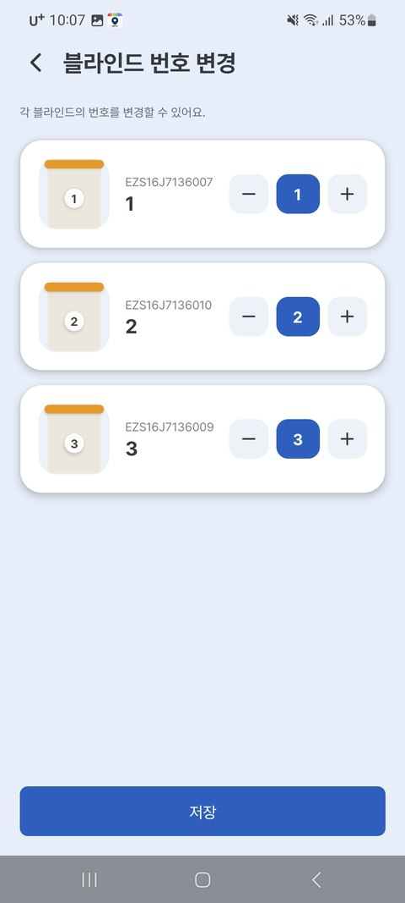

# 2. 기기 등록하기

블라인드를 집 WiFi와 앱에 연결하는 단계입니다. 처음 한 번만 하면 됩니다. (약 3분)

---

## 준비물

- 로그인된 이지롤 앱 ([1. 시작하기](01_시작하기.md) 참고)
- **집 WiFi 이름과 비밀번호** (2.4GHz여야 합니다 — 아래 참고)
- 블라인드 본체의 **QR 코드** (본체 라벨에 인쇄 — 없으면 기기 이름/비밀번호로 직접 입력 가능)

> ⚠️ **등록 전 꼭 확인하세요** (앱 안내와 동일)
>
> 1. **2.4GHz** WiFi에만 연결됩니다 — 공유기 이름이 `...5G`로 끝나면 5G가 **안 붙은** 쪽을 고르세요.
> 2. 공유기에 **비밀번호가 설정**되어 있어야 합니다.
> 3. 등록하는 동안 폰의 **블루투스와 스마트워치를 꺼 주세요.**
> 4. 공유기 근처에 블루투스 장비를 가까이 두지 마세요.

---

## 등록 순서 — 여러 대도 한 번에!

블라인드가 여러 대라면 **한 구역(방) 단위로 한꺼번에** 등록할 수 있습니다.

**① 구역 만들기** — 구역(거실·안방 등)을 고르고, 설치할 **블라인드 수량**을 선택합니다.

{ width="300" }

**② QR 코드 스캔** — 화면의 블라인드 그림을 순서대로 눌러 각 기기의 **QR 코드를 촬영**합니다. (1번 그림 → 1번 블라인드가 됩니다)

{ width="300" }

> 💡 QR 코드가 없거나 스캔이 어려우면 화면 아래 **[QR코드가 없으신가요?]** 로 직접 입력할 수 있어요.

**③ WiFi 연결** — 주의사항 확인 후, 집 WiFi를 목록에서 고르고 비밀번호를 입력합니다.

{ width="300" }

**④ 자동 등록** — 블라인드들이 **순서대로 자동 연결**됩니다. (연결 준비 → 공유기 정보 전송 → 기기 확인 → 완료)

{ width="300" }

**⑤ 등록 완료!**

{ width="300" }

> ⚠️ **DIY 모터만 구매하신 경우, 등록 직후 [상/하단 설정](03_기본_사용법.md)을 꼭 해 주세요.** (완제품 블라인드+모터 세트는 건너뛰어도 됩니다)
> 💡 등록을 마쳤는데 기기가 안 보이면 **앱을 재시작**해 보세요.

등록이 끝나면 블라인드가 집 WiFi에 연결되어, **집 밖에서도** 앱으로 제어할 수 있습니다.

---

## 구역·번호 정리하기

블라인드가 여러 개면 **구역(방)별로 묶고 번호를 매겨** 두면 헷갈리지 않습니다.
구역 이름 옆 **⚙(톱니)** → **[구역 기기 설정]** 에 모든 정리 메뉴가 모여 있습니다.

{ width="300" }

| 정리 | 방법 | 예 |
|---|---|---|
| **블라인드 번호 변경** | 구역 기기 설정 → 블라인드 번호 변경 | 거실 1번 / 거실 2번 |
| **다른 구역으로 이동** | 구역 기기 설정 → 블라인드 구역 변경 | 거실 → 안방 |
| **구역 이름 바꾸기** | 구역 이름 옆 ⚙ → 이름 변경 | "구역1" → "거실" |

{ width="300" }

> 💡 번호를 매겨 두면 나중에 **여러 대를 가지런히 맞추기**([4장](05_여러대_함께_사용.md))나 문의할 때 "거실 2번"처럼 콕 집어 말할 수 있어요.

---

## 잘 안 될 때

| 증상 | 해결 |
|---|---|
| 등록 화면에서 블라인드를 못 찾음 | 전원을 뺐다 다시 꽂고 1분 기다린 후 재시도. 검색 안 된 기기는 나중에 **설정 → 기기추가**로 추가 가능 |
| 집 WiFi 비밀번호를 잘못 입력 | 처음부터 다시 — 기기가 자동으로 등록 대기 상태로 돌아갑니다 |
| "등록 실패"가 반복됨 | 공유기가 **2.4GHz**인지 확인 / 블루투스·스마트워치가 꺼져 있는지 확인 / 공유기와 블라인드 거리 확인 |
| 등록 후 기기가 앱에 안 보임 | **앱을 완전히 종료 후 재시작** |
| 이미 등록했던 기기를 다시 등록 | 기기 버튼을 **5초 이상 길게** 눌러 초기화 → 처음부터 |

더 자세한 증상별 대처는 [문제해결 FAQ](06_문제해결_FAQ.md)를 보세요.

---

이전 ← [1. 시작하기](01_시작하기.md) | 다음 → [3. 기본 사용법](03_기본_사용법.md)
