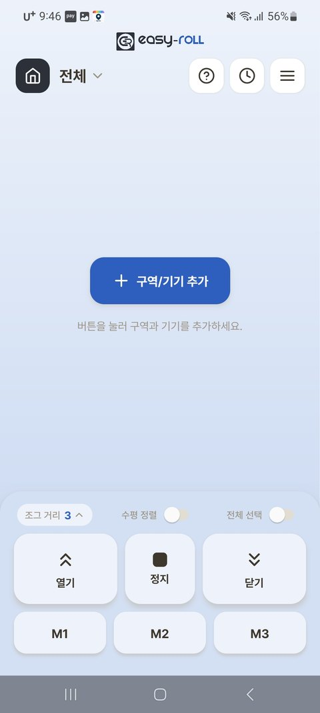
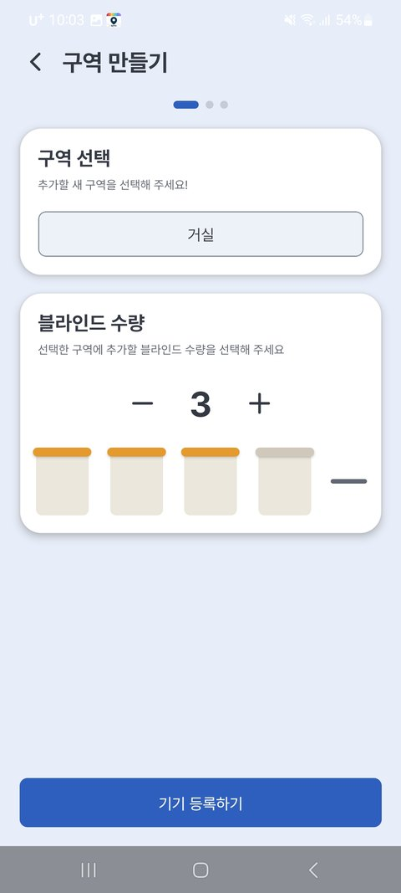
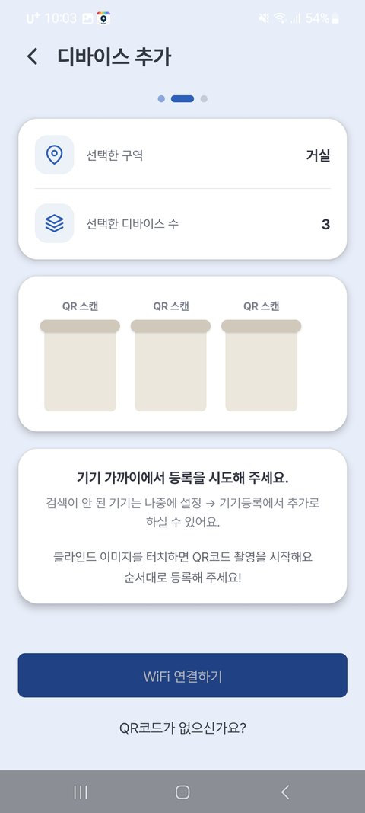
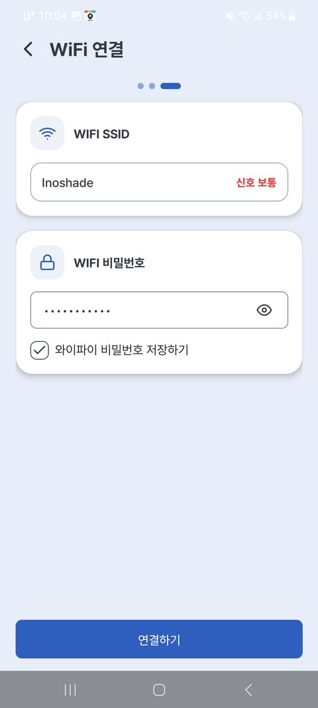
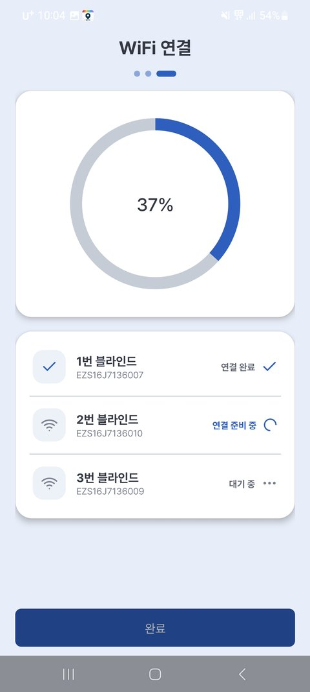
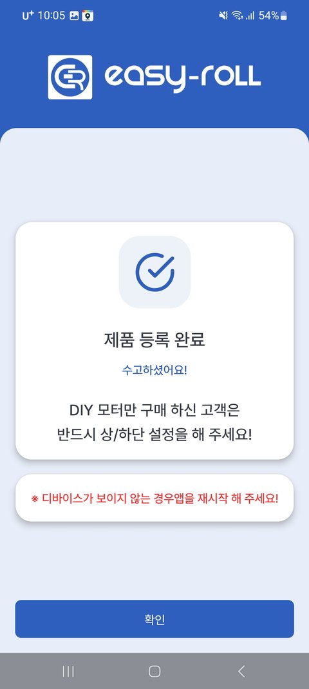

# 2. 기기 등록하기

블라인드 기기를 집 WiFi(공유기)와 앱에 연결하는 단계입니다. 처음 한 번만 하면 됩니다. (약 3분)

---

## 준비물

- 로그인된 이지롤 앱 ([1-2. 앱 설치와 회원가입](02_앱_설치_회원가입.md) 참고)
- **집 WiFi(공유기) 이름과 비밀번호** (2.4GHz여야 합니다 — 아래 참고)
- 블라인드 기기의 **QR 코드**

> ⚠️ **등록 전 꼭 확인하세요** (앱 안내와 동일)
>
> 1. **2.4GHz** WiFi에만 연결됩니다 — 공유기 이름이 `...5G`로 끝나면 5G가 **안 붙은** 쪽을 고르세요.
> 2. 공유기에 **비밀번호가 설정**되어 있어야 합니다.
> 3. 등록하는 동안 폰의 **블루투스와 스마트워치를 꺼 주세요.**
> 4. 공유기 근처에 블루투스 장비를 가까이 두지 마세요.

---

## 등록 순서 — 여러 대도 한 번에!

블라인드가 여러 대라면 **한 구역(방) 단위로 한꺼번에** 등록할 수 있습니다.

**① 시작하기** — 로그인 후 처음 만나는 화면입니다. 가운데 **[+ 구역/기기 추가]** 버튼을 눌러 시작하세요.

{ width="300" }

**② 구역 만들기** — 구역(거실·안방 등)을 고르고, 설치할 **블라인드 수량**을 선택합니다.

{ width="300" }

**③ QR 코드 스캔** — 화면의 블라인드 그림을 순서대로 눌러 각 기기의 **QR 코드를 촬영**합니다. (1번 그림 → 1번 블라인드가 됩니다)

{ width="300" }

> 💡 QR 코드가 없거나 스캔이 어려우면 화면 아래 **[QR코드가 없으신가요?]** 로 주변 블라인드 기기를 검색해서 등록할 수 있어요.
>
> 검색 목록에는 각 기기의 **신호 세기(막대)** 와 **일련번호 뒷자리**가 표시됩니다. **막대가 강할수록 폰과 가까운 기기**이고, **강조된 뒷자리 번호를 기기 라벨(EZS…)과 대조**하면 어떤 실물 기기인지 쉽게 찾을 수 있어요.

**④ WiFi 연결** — 주의사항 확인 후, 집 WiFi를 목록에서 고르고 비밀번호를 입력합니다.

{ width="300" }

**⑤ 자동 등록** — 블라인드들이 **순서대로 자동 연결**됩니다. (연결 준비 → 공유기 정보 전송 → 기기 확인 → 완료)

{ width="300" }

> 💡 중간에 **"네트워크 대기, 곧 재시도"** 가 보여도 정상이에요. 신호가 잠깐 늦으면 앱이 **자동으로 다시 시도**합니다 — 바로 실패로 여기지 말고 잠시 기다려 주세요.

**⑥ 등록 완료!**

{ width="300" }

> 💡 등록을 마쳤는데 기기가 안 보이면 **앱을 재시작**해 보세요.

등록이 끝나면 블라인드가 집 WiFi에 연결되어, **집 밖에서도** 앱으로 제어할 수 있습니다.

---

## 잘 안 될 때

| 증상 | 해결 |
|---|---|
| "등록 실패"가 반복됨 | 스캔한 **QR코드와 등록할 기기가 일치**하는지 확인 / 공유기가 **2.4GHz**인지 확인 / 블루투스·스마트워치가 꺼져 있는지 확인 |
| **"네트워크 대기, 곧 재시도"** 가 표시됨 | 일시적 지연으로 **자동 재시도 중**입니다. 잠시 기다리면 이어서 진행돼요. 계속 반복되면 폰을 기기 가까이 두고 2.4GHz·비밀번호를 확인하세요 |
| 등록이 자꾸 끊기거나 느림 | 등록하는 동안 **스마트폰을 블라인드 기기 가까이**에 두세요. 거리가 멀면 연결이 실패할 수 있습니다 |
| 등록 후 기기가 앱에 안 보임 | **앱을 완전히 종료 후 재시작** |

더 자세한 증상별 대처는 [문제해결 FAQ](06_문제해결_FAQ.md)를 보세요.
