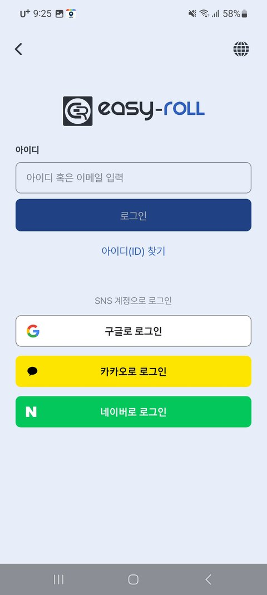

# 1-2. Installing the App & Signing Up

To control your blinds from your smartphone, you'll need the **EasyRoll app**. From install to login takes just 2 minutes.

---

## Installing the App

{ .no-frame }

**EasyRoll Smart Blind**
Look for this icon in your app store

| Smartphone | How to install |
|---|---|
| Android | Search "EasyRoll" on Google Play → Install |
| iPhone | Search "EasyRoll" on the App Store → Install |

---

## Sign Up · Log In

The first time you open the app, a login screen appears. Choose whichever method is easiest for you.

| Method | Description |
|---|---|
| **Social Login** | Start right away with your Google, Kakao, or Naver account (no separate password needed) |
| **Email Sign-up** | Sign up directly with an email + password |

{ width="300" }

> 💡 When you first sign up, you'll select your **region (country)**. Alarm and time features run according to that region's time.

Once you're logged in, it's time for the next step — **registering your blind in the app**.
