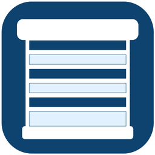
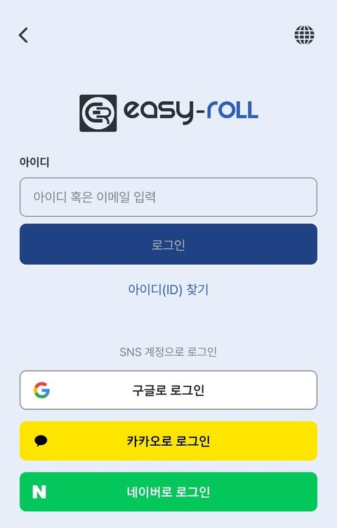

# 1-2. Installing the App & Signing Up

To control your blinds from your smartphone, you'll need the **EasyRoll app**. From install to login takes just 2 minutes.

---

## Installing the App

{ .no-frame }

**EasyRoll Smart Blind**
Look for this icon in your app store

| Smartphone | How to install |
|---|---|
| Android | Search "EasyRoll" on Google Play → Install |
| iPhone | Search "EasyRoll" on the App Store → Install |

---

## Sign Up · Log In

The first time you open the app, a **start screen** appears. If you're new, tap **[Create a username]**; if you already have an account, tap **[Login]** next to "Already signed up?" at the bottom. Both screens offer social login buttons.

| Method | Description |
|---|---|
| **Social Login** | **Android** Google · Kakao · Naver / **iPhone** Kakao · Naver · Apple · Google — start right away with an account you already use (no separate password needed) |
| **Email Sign-up** | **[Create a username]** → **[Sign up with EasyRoll]** — sign up directly with an email + password |

{ width="300" }

> 💡 When you first sign up, you'll select your **region (country)**. Alarm and time features run according to that region's time.

Once you're logged in, it's time for the next step — **registering your blind in the app**.
