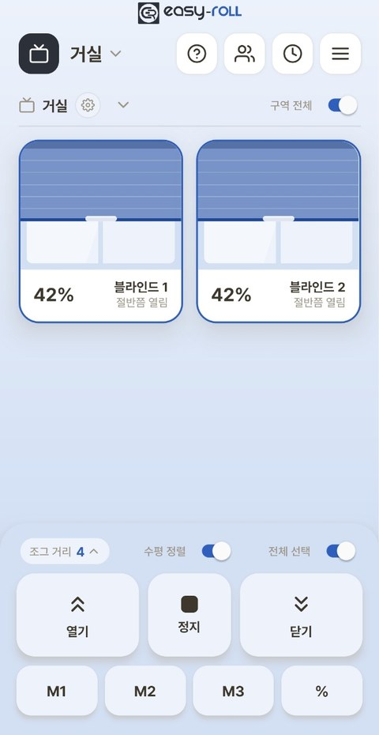
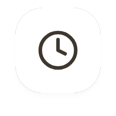
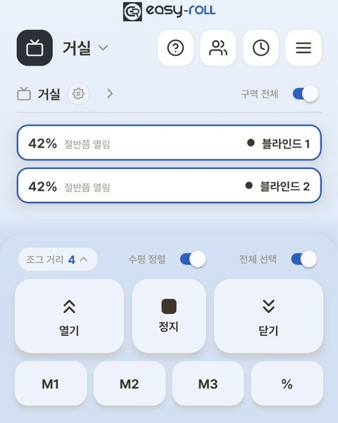
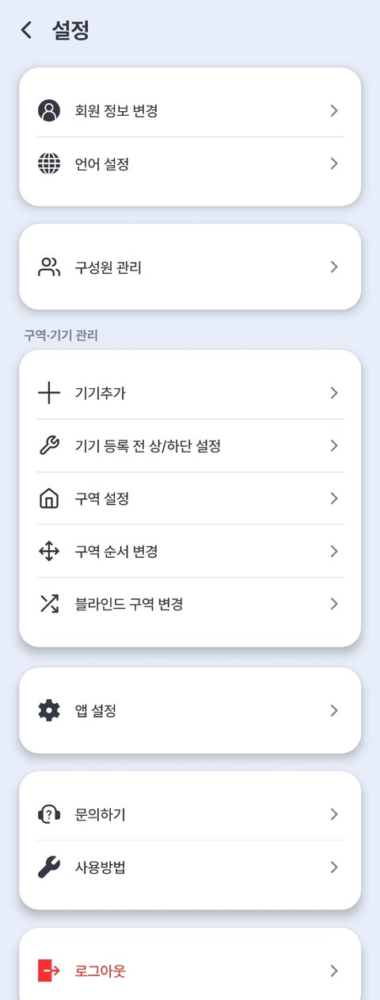

# 3. Basic Usage

---

## Controlling from the App

{ width="300" }

| Button | Action |
|---|---|
| ⌃ Open | Raises all the way to the top (tap briefly to move a little at a time) |
| ⌄ Close | Lowers all the way to the bottom (tap briefly to move a little at a time) |
| ■ Stop | Stops right where it is |
| Blind card | **Tap** — select which blind to control (you can select several) **Press and hold the blind image, then drag up/down** — release when **"Release to move"** appears to move to that position (%) **Tap the % number** — move just that blind to the position (%) you want **Long-press the name** — open the **[Device info]** screen |
| **%** | Move the selected blinds **to any position (%)** — scroll the number or type it in (e.g. 30%) |

> 💡 3-channel devices whose device ID starts with **EZS11** don't support dragging the image or tapping the % number. For blinds shared with you, long-pressing the name doesn't open [Device info].

**Icons at the top of the main screen**

| Icon | What it does |
|---|---|
| { width="52" .no-frame } | Replay the usage guide |
| { width="52" .no-frame } | Manage Members — invite family or colleagues to share ([Add Members](10_구성원_추가.md)) |
| { width="52" .no-frame } | Alarms (schedules) ([3-1. Alarm Settings](07_알람.md)) |
| { width="52" .no-frame } | Settings menu |

!!! tip "Good to know"

    - **Tap briefly to move a little, long-press to move all the way.**
    - **[Jog step]** (levels 1–4) — adjusts how far it moves on a brief tap. The lower the number, the smaller and more precise the movement. *(Handy for lining up combi blind patterns)*
    - **[Whole zone]** toggle — when on, all blinds in that zone move together.
    - **[Auto-Level]** toggle — when you move several blinds together, it **automatically aligns their heights (the bottom-bar line)**. For details, see [4. Using Multiple Blinds Together](05_여러대_함께_사용.md).

### Simplify the Screen — List View

Tap the **⌄ (arrow)** next to a zone title to collapse the cards into a **one-line summary list**. Handy when you have many blinds.

{ width="300" }

> 💡 The list works just like the cards: **tap** to select, **tap the % number** to set the position (%) of just that blind, and **long-press the name** for [Device info]. (Dragging works on cards only.)

---

## Saving Frequently Used Positions (Memory)

You can save up to **three (M1, M2, M3)** frequently used heights (e.g. open halfway) and recall them in one tap.

- **Save** — move to the height you want → **long-press** a memory button (M1–M3) → confirm save
- **Recall** — **tap** a memory button briefly to move straight to that height

> 💡 The M1–M3 positions you've saved can also be used as-is in [3-1. Alarm Settings](07_알람.md). (e.g. move to the M1 position at 7 a.m.)

---

## Settings Menu at a Glance (Menu ≡ → Settings)

{ width="300" }

| Menu | What it does |
|---|---|
| **Change member information · Set language** | Account and app language |
| **Manage Members** | Invite family or colleagues to share (also opens from the **👥** icon at the top of the main screen) — see [Add Members](10_구성원_추가.md) |
| *Zone & device management* | *(on the screen, the next four rows — Add device through Change zone order · Move blind to another zone — are grouped under this heading)* |
| **Add device** | Register an additional blind |
| **Up/down setting before device registration** | Set the upper/lower limits before registering in the app — your phone connects straight to the blind, no router needed |
| **Zone settings** | Manage devices by zone (upper/lower limits, Auto-Level, remote, Wi-Fi router, **Home Assistant connection**, updates, device info) — covered in each chapter |
| **Change zone order · Move blind to another zone** | Organize the order and grouping shown on the main screen |
| **App settings** | Set Triple shade mode, Push notification, Background color, and more |
| **Contact us · How to use** | Customer support, usage guides |

---

## Good to Know

- **If the blind snags on something while lowering, it stops automatically** (motor protection). Clear the obstruction and run it again.
- **A slight movement each time the power is turned on** is normal (an operation-check motion).
