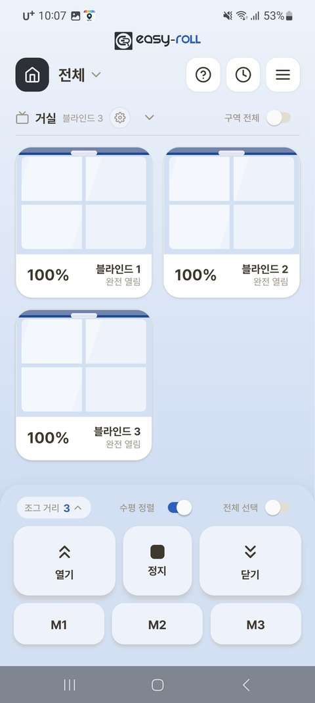
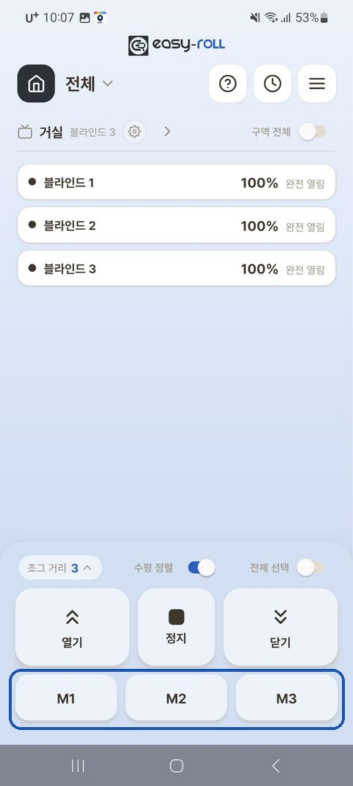
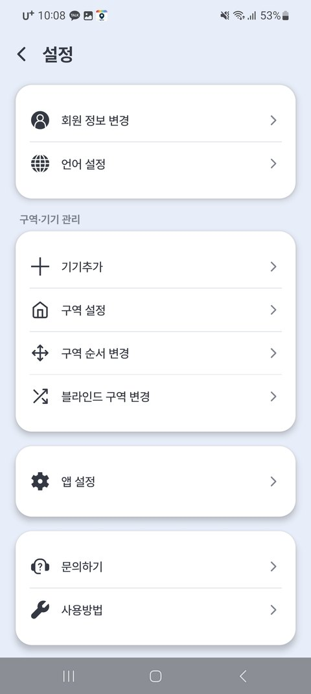

# 3. 기본 사용법

---

## 앱에서 제어하기

{ width="300" }

| 버튼 | 동작 |
|---|---|
| ⌃ 열기 | 맨 위까지 올라감 (짧게 누르면 조금씩) |
| ⌄ 닫기 | 맨 아래까지 내려감 (짧게 누르면 조금씩) |
| ■ 정지 | 그 자리에 멈춤 |
| 블라인드 카드 | **터치** — 제어할 블라인드 선택 (여러 개 선택 가능) **길게 누르기** — 원하는 **위치(%)를 지정**해 그 높이로 바로 이동 |

!!! tip "알아두면 좋아요"

    - **짧게 누르면 조금씩, 길게 누르면 끝까지** 움직입니다.
    - **[조그 거리]** (1~4단계) — 짧게 눌렀을 때 움직이는 양을 조절합니다. 숫자가 낮을수록 조금씩 정밀하게 움직여요. *(콤비블라인드 무늬 맞출 때 유용)*
    - **[구역 전체]** 토글 — 켜면 그 구역의 모든 블라인드가 한꺼번에 움직입니다.
    - **[수평 정렬]** 토글 — 여러 대를 함께 움직였을 때 **높이(하단바 줄)를 자동으로 맞춰** 줍니다. 자세한 내용은 [4. 여러 대 함께 사용](05_여러대_함께_사용.md) 참고.

### 화면을 간단하게 — 목록 보기

구역 제목 옆 **⌄(화살표)** 를 누르면 카드 대신 **한 줄 요약 목록**으로 접을 수 있습니다. 블라인드가 많을 때 편리해요.

{ width="300" }

---

## 자주 쓰는 위치 저장 (메모리)

자주 쓰는 높이(예: 절반만 열기)를 **3개(M1·M2·M3)**까지 저장해 두고 한 번에 부를 수 있습니다.

- **저장** — 원하는 높이로 이동 → 메모리 버튼(M1~M3)을 **길게 누름** → 저장 확인
- **이동** — 메모리 버튼을 **짧게 누르면** 그 높이로 바로 이동

> 💡 저장해 둔 M1~M3 위치는 [3-1. 알람 설정](07_알람.md)에서도 그대로 쓸 수 있어요. (예: 아침 7시에 M1 위치로)

---

## 설정 메뉴 한눈에 (메뉴 ≡ → 설정)

{ width="300" }

| 메뉴 | 무엇 |
|---|---|
| **회원 정보 변경 · 언어 설정** | 계정·앱 언어 |
| **기기추가** | 블라인드 추가 등록 |
| **구역 설정** | 구역별 기기 관리(상/하단·수평 정렬·리모컨·공유기·업데이트) — 각 장에서 안내 |
| **구역 순서 변경 · 블라인드 구역 변경** | 메인에 보이는 순서·소속 정리 |
| **앱 설정** | 트리플 쉐이드 모드 · 푸시 알림 · 배경 테마 등을 설정할 수 있습니다 |
| **문의하기 · 사용방법** | 고객 지원, 사용 안내 |

---

## 알아두면 좋은 점

- **내려가다 무언가에 걸리면 자동으로 멈춥니다** (모터 보호). 걸린 물건을 치우고 다시 동작시키세요.
- **전원을 켤 때마다 살짝 움직이는 것**은 정상(작동 확인 동작)입니다.
