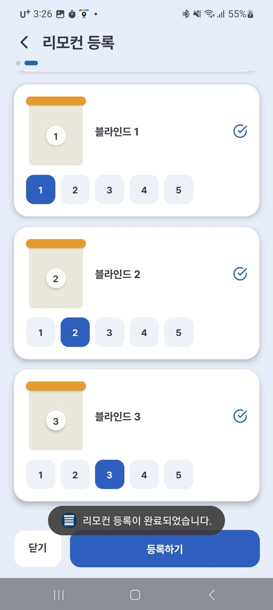
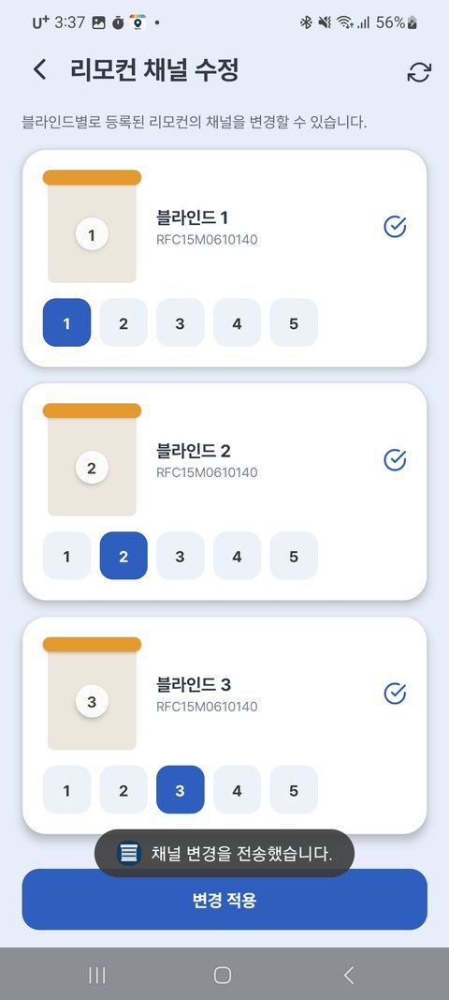
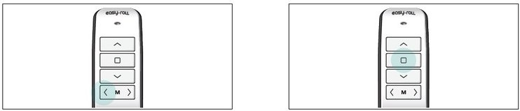
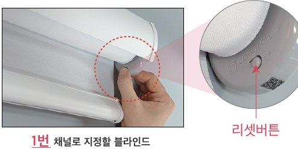
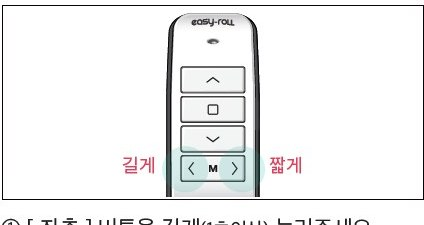
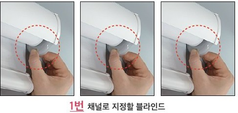
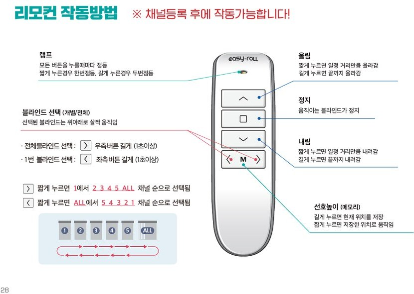

# 5. Using the Remote Control

The remote control works **even without WiFi** (it uses a dedicated wireless signal). Even if your internet goes down, the remote always works.

{ width="180" }

---

## Remote Pairing (Channel Registration)

To use the remote, you need to **register your blind to a remote channel**. There are two ways to do this.

=== "Register with the App (Recommended)"

    This is the easiest way — you just tap a channel on the app screen to assign it.

    !!! warning "The device must be registered in the app first"

        Your blind must be **registered in the app** before you can register the remote through the app. If you haven't registered it yet, please complete [2. Register Device](02_앱_등록하기.md) first.
        If you want to use the remote without registering in the app, see the **[Register Directly with the Remote]** tab.

    Location: **⚙** next to the zone name → **[Zone Device Settings]** → **[Register/Edit Remote Channel]**

    1. Open **[Register/Edit Remote Channel]**.
    2. **Select the channel (1–5)** to use for each blind.
    3. **Save**, and registration is complete.

    { width="300" }

    { width="300" }

    > 💡 If you want to change the channel later, you can edit it from the same menu.

=== "Register Directly with the Remote (No App)"

    This is how to register using **just the remote and the blind device**, without the app.

    #### Registering one blind to channel 1

    { width="520" }

    1. **Press and hold the [◀ Left] button** on the remote (for at least 1 second).
    2. **Press and hold the [■ Stop] button for at least 5 seconds.**
        - The **LEDs on all blind motors will blink.**
    3. **Firmly press and quickly release the reset button on the blind motor** you want to assign to channel 1.
        - When the LED blinks rapidly several times, **channel 1 is assigned!**

    { width="360" }

    #### Registering channels 2–5

    Only the **number of short presses of the [▶ Right] button** in step ① changes; everything else is the same.

    | Channel | In step ① |
    |---|---|
    | **1** | Hold [◀ Left] only |
    | **2** | Hold [◀ Left] + press [▶ Right] briefly **once** |
    | **3** | Hold [◀ Left] + press [▶ Right] briefly **twice** |
    | **4** | Hold [◀ Left] + press [▶ Right] briefly **three times** |
    | **5** | Hold [◀ Left] + press [▶ Right] briefly **four times** |

    { width="360" }

    #### Grouping several blinds on one channel (Group Registration)

    If you register **several** blinds to one channel, they all move together on that channel.
    The method is the same — in step ③, just press the **reset button on each of the blinds you want to group**, one after another.

    { width="400" }

    > 💡 Registration is retained even when the power is turned off.

---

## Getting to Know the Remote Buttons

| Button | Action |
|---|---|
| **⌃ Up** | Short press = raises a set distance · Long press = raises all the way up |
| **■ Stop** | Stops a moving blind |
| **⌄ Down** | Short press = lowers a set distance · Long press = lowers all the way down |
| **◀ ▶ Channel Select** | Each short press cycles `1 → 2 → 3 → 4 → 5 → ALL` **Hold [▶ Right]** = selects all blinds · **Hold [◀ Left]** = selects blind 1 |
| **M Favorite Height (Memory)** | **Long press** = saves the current position · **Short press** = moves to the saved position |
| **Lamp** | Turns on each time you press the button (once for a short press, twice for a long press) |

> 💡 When you select a channel, **the selected blind moves slightly up and down** to let you know.

---

## Controlling Several Blinds by Channel

| Channel | Action |
|---|---|
| **1 – 5** | Only the blinds registered to that channel operate |
| **ALL** | All registered blinds operate together |

> Example: Register 3 living room blinds to channels 1, 2, and 3 respectively → switch channels to control them one at a time.
> If you register several blinds to the **same channel**, they move together on that channel.

---

## When Things Don't Work

| Symptom | Solution |
|---|---|
| No response when pressed | Check that the channel is correct → replace the battery → re-register |
| One press moves a neighboring blind too | Channels are registered with overlap — re-register each to a different channel |
| Registration won't work | Try again close to the device (1–2 m) |
