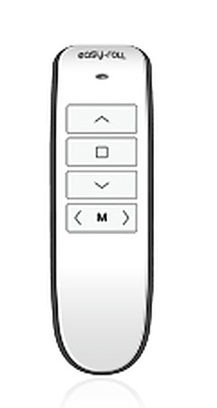

# 5. 리모컨 사용하기

리모컨은 **WiFi 없이도** 동작합니다(전용 무선 신호). 인터넷이 끊겨도 리모컨은 항상 됩니다.

---

## 리모컨 등록 (페어링)

새 리모컨이나 추가 리모컨은 처음 한 번 등록이 필요합니다.

```
① 블라인드 본체 버튼을 짧게 1번 누름   → LED 깜빡임 시작 (등록 대기)
② 리모컨의 설정 버튼을 길게 누름        → 리모컨이 등록 신호 전송
③ 본체 버튼을 다시 1번 누름            → 확인 깜빡임 → 등록 완료!
```

{ width="180" }

- 등록은 전원이 꺼져도 유지됩니다.
- 리모컨 1개로 **채널을 나눠 여러 대**를 제어할 수 있습니다(아래).

> 💡 앱에서도 **리모컨 등록·채널 수정**을 할 수 있습니다. (메뉴 → 리모컨 등록 / 채널)
> ✍️ (앱 리모컨 등록 화면 스크린샷 — UserRoute/Device/RemoteRegister, RemoteChannel)

---

## 채널로 여러 대 제어

| 채널 | 동작 |
|---|---|
| 1 ~ 4 | 그 채널에 등록된 블라인드만 동작 |
| **전체** | 등록된 모든 블라인드가 함께 동작 |

> 예: 거실 블라인드 3대를 채널 1·2·3에 각각 등록 → 하나씩 따로, 또는 전체 채널로 한꺼번에.

---

## 버튼 동작

| 리모컨 버튼 | 동작 |
|---|---|
| ▲ | 맨 위까지 (이동 중 누르면 정지) |
| ▼ | 맨 아래까지 |
| ■ 정지 | 멈춤 |
| ◀ ▶ | 채널 이동 (제어할 블라인드 선택) |
| M | 메모리 — 저장해 둔 위치로 이동 |

---

## 잘 안 될 때

| 증상 | 해결 |
|---|---|
| 눌러도 반응 없음 | 채널이 맞는지 확인 → 배터리 교체 → 재등록 |
| 한 번 눌렀는데 옆 블라인드도 움직임 | 채널이 겹치게 등록됨 — 각각 다른 채널로 재등록 |
| 등록이 안 됨 | 본체 가까이(1~2m)에서 재시도 |

---

이전 ← [4. 여러 대 함께 사용](05_여러대_함께_사용.md) | 다음 → [6. 알람 설정](07_알람.md)
