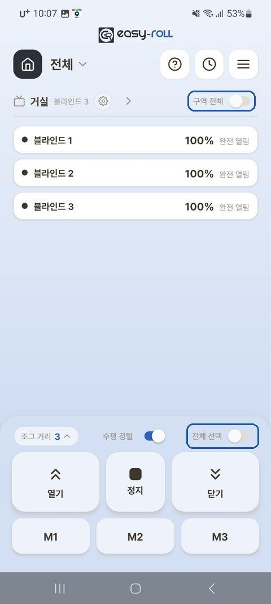

# 4. 여러 대 함께 사용

블라인드를 여러 대 설치했다면, **구역(방) 단위로 한꺼번에** 제어하고 **높이를 가지런히 맞출** 수 있습니다.

---

## 구역으로 한꺼번에 제어

메인 화면에서 **[구역 전체]** 토글을 켜면 그 구역 전체가 선택되고, 제어판의 **[전체 선택]** 은 화면의 모든 블라인드를 선택합니다.

{ width="300" }

---

## 높이 가지런히 맞추기 — 수평 정렬

한 구역에서 **여러 블라인드를 함께 올리거나 내린 뒤 멈추면**, 움직인 블라인드들을 **가장 위(올림)** 또는 **가장 아래(내림)** 기준으로 높이를 **자동으로 가지런히 맞춰 주는** 기능입니다.

### ① 먼저 켜기 (구역별로 한 번만)

구역 이름 옆 **⚙** → **[구역 기기 설정]** → **[수평 정렬 설정]** → 맞추고 싶은 **구역을 ON**

> 💡 메인 화면 제어판의 **[수평 정렬]** 토글로도 켜고 끌 수 있어요.

### ② 사용하기

수평 정렬을 켠 구역에서 **2대 이상을 함께** 움직이면:

| 동작 | 결과 |
|---|---|
| **올림** 후 정지 | 그중 **가장 위**에 맞춰 나머지가 정렬 |
| **내림** 후 정지 | 그중 **가장 아래**에 맞춰 정렬 |
| **정지 버튼을 길게** 누름 | **중간(평균) 높이**로 정렬 |
| **멈춘 상태에서 [정지]를 다시** 누름 | **"위쪽 / 아래쪽 맞춤"** 선택 팝업 → 고른 방향으로 정렬 |

> 💡 **그때 움직인 블라인드만** 정렬됩니다. (예: 4개 중 2개만 올렸다 멈추면 그 2개만 맞춰짐)
> 💡 블라인드 길이가 서로 달라도 **하단바가 실제로 나란**해지도록 맞춥니다.

> 💡 **정렬 방향을 직접 고르고 싶을 때** — 블라인드가 멈춰 있는 상태에서 **[정지]를 한 번 더** 누르면 **[위쪽에 맞춤] · [아래쪽에 맞춤]** 팝업이 떠요. 원하는 쪽을 고르면 그 방향으로 가지런히 정렬됩니다.

> ℹ️ 수평 정렬은 **멈춘 뒤에 맞추는 방식**이라, 정지 직후 끝에서 **살짝 보정 움직임**이 보일 수 있습니다. 정상입니다.

---

## WiFi 신호가 약한 블라인드가 있다면

공유기에서 먼 블라인드는 신호가 약해 반응이 느릴 수 있습니다.

- 공유기를 **블라인드들과 더 가까운 위치**로 옮기거나, **WiFi 증폭기(확장기)**를 두면 좋아집니다.
- 한 대만 자꾸 느리거나 끊기면, 그 위치의 신호 세기를 점검해 보세요.
