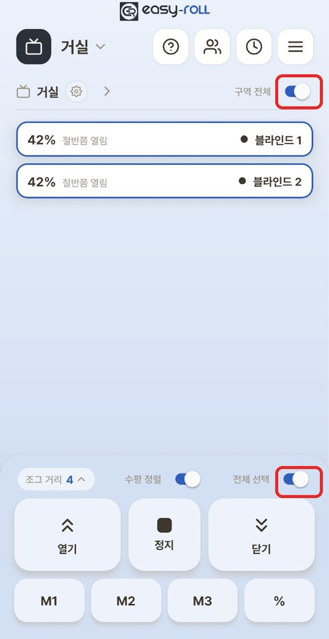

# 4. 여러 대 함께 사용

블라인드를 여러 대 설치했다면, **구역(방) 단위로 한꺼번에** 제어하고 **높이를 가지런히 맞출** 수 있습니다.

---

## 구역으로 한꺼번에 제어

메인 화면에서 **[구역 전체]** 토글을 켜면 그 구역 전체가 선택되고, 제어판의 **[전체 선택]** 토글은 화면의 모든 블라인드를 선택합니다.

{ width="300" }

---

## 높이 가지런히 맞추기 — 수평 정렬

한 구역에서 **여러 블라인드를 함께 올리거나 내린 뒤 [정지]를 누르면**, 움직인 블라인드들을 **가장 위(올림)** 또는 **가장 아래(내림)** 기준으로 높이를 **자동으로 가지런히 맞춰 주는** 기능입니다.

### ① 먼저 켜기 (구역별로 한 번만)

구역 이름 옆 **⚙** → **[구역 기기 설정]** → **[수평 정렬 설정]** → 맞추고 싶은 **구역을 ON**

> 💡 메인 화면 제어판의 **[수평 정렬]** 토글은 **모든 구역을 한꺼번에** 켜고 끕니다. (끄면 구역별로 켜 둔 설정도 모두 꺼져요.) 구역마다 따로 쓰려면 위의 **[수평 정렬 설정]** 에서 켜세요.

> ℹ️ 수평 정렬 설정은 **이 폰(앱)에만 저장**됩니다. 가족 구성원이나 다른 폰에서는 각자 켜 주세요.

### ② 사용하기

수평 정렬을 켠 구역에서 **2대 이상을 함께** 움직인 뒤:

| 동작 | 결과 |
|---|---|
| **올림** 후 **[정지]** | 그중 **가장 위**에 맞춰 나머지가 정렬 |
| **내림** 후 **[정지]** | 그중 **가장 아래**에 맞춰 정렬 |
| **[정지]를 1.5초 이상 길게** 누르고 있기 | **[상단 정렬] · [하단 정렬] · [평균값 정렬]** 선택 팝업 → 고른 높이(가장 위 · 가장 아래 · 평균 높이)로 정렬 |

> 💡 자동 정렬은 **[열기] · [닫기]를 누른 뒤 1분 안에 [정지]를 눌렀을 때** 실행됩니다. (M1~M3 · %로 이동했을 때는 자동 정렬하지 않아요.) [정지]를 누르기 전에 블라인드가 저절로 멈췄다면(짧게 눌러 조금만 움직인 경우 등) 1분 안에 **[정지]를 한 번** 눌러 주세요. (이미 [정지]를 한 번 눌렀거나 1분이 지났으면 [정지]를 다시 짧게 눌러도 아무 동작도 하지 않아요.)

> 💡 **그때 움직인 블라인드만** 정렬됩니다. (예: 4개 중 2개만 올렸다 멈추면 그 2개만 맞춰짐)

> 💡 블라인드 길이가 서로 달라도 **하단바가 실제로 나란**해지도록 맞춥니다.

> 💡 **정렬 높이를 직접 고르고 싶을 때** — **[정지]를 손을 떼지 말고 1.5초 이상** 누르고 있으면 **[상단 정렬] · [하단 정렬] · [평균값 정렬]** 팝업이 떠요. 원하는 것을 고르면 선택한 블라인드들이 그 높이로 가지런히 정렬됩니다. 방금 움직이지 않았어도 정렬할 블라인드를 선택해 두고 언제든 쓸 수 있어요. (1.5초 전에 손을 떼면 팝업 없이 평소처럼 이동 방향대로 정렬)

> ℹ️ 팝업은 **맞출 블라인드가 있을 때만** 뜹니다. 수평 정렬을 켠 구역에서 **높이가 서로 다른 블라인드를 2대 이상** 선택한 경우예요.

> ℹ️ 수평 정렬은 **멈춘 뒤에 맞추는 방식**이라, 정지 직후 끝에서 **살짝 보정 움직임**이 보일 수 있습니다. 정상입니다.

---

## WiFi 신호가 약한 블라인드가 있다면

공유기에서 먼 블라인드는 신호가 약해 반응이 느릴 수 있습니다.

- 공유기를 **블라인드들과 더 가까운 위치**로 옮기거나, **WiFi 증폭기(확장기)**를 두면 좋아집니다.
- 한 대만 자꾸 느리거나 끊기면, 그 위치의 신호 세기를 점검해 보세요.
