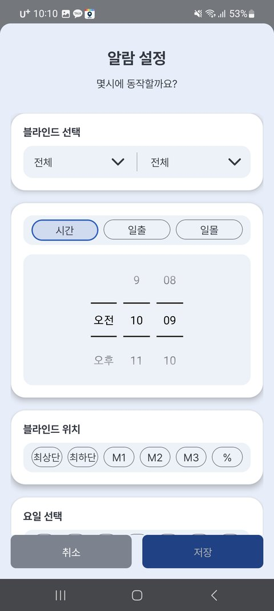
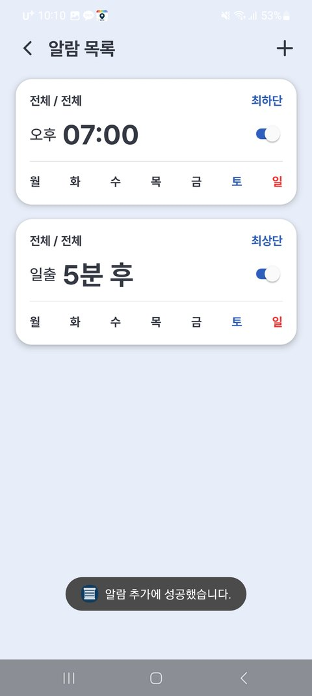
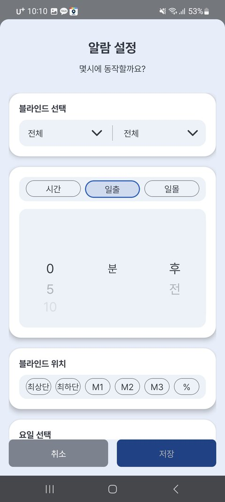

# 3-1. 알람 설정 (정해진 시간에 자동으로)

정해진 시간에 블라인드가 **자동으로 열리고 닫히게** 할 수 있습니다. (예: 평일 아침 7시에 열기)

---

## 알람 추가하기

1. 앱 메인 상단 **🕐** → **[알람]** → 오른쪽 위 **[+]**
2. **블라인드 선택** (구역/기기)
3. **시간 선택**
4. **블라인드 위치 선택**
5. **요일 선택** → **저장**

{ width="300" }

| 항목 | 설명 |
|---|---|
| 시간 | 몇 시 몇 분에 동작할지 (또는 일출·일몰 기준 — 아래) |
| 블라인드 위치 | **최상단 / 최하단 / M1~M3(저장 위치) / 원하는 %** |
| 요일 | 반복할 요일 |
| 블라인드 | 어떤 구역·블라인드에 적용할지 |

만든 알람은 목록에서 **스위치로 켜고 끌 수** 있습니다.

{ width="300" }

---

## 해 뜰 때 / 해 질 때 맞춰 (일출·일몰 알람)

정해진 시각 대신 **일출(해 뜰 때)·일몰(해 질 때)** 기준으로도 맞출 수 있습니다. 계절마다 시각이 바뀌어도 알아서 따라갑니다.

알람 추가 시 **[시간 | 일출 | 일몰]** 중 선택 → 기준보다 **[몇 분 전 / 몇 분 후]** 를 지정합니다.

> 예) **일몰 30분 후**에 닫기 · **일출 10분 전**에 열기

{ width="300" }

> 💡 지역(가입 시 선택한 지역)의 일출·일몰 시각을 기준으로 동작합니다.

---

## 알람 수정·삭제

- **켜기/끄기** — 목록에서 알람 옆 스위치
- **수정** — 알람 목록에서 해당 알람을 선택 → 내용 변경
- **삭제** — 알람 **카드를 길게 누르면** 삭제 화면이 나타납니다. 지울 알람을 선택해 삭제하세요.

---

> ⚠️ **알람은 인터넷 연결이 필요합니다.** 정해진 시각에 **서버가 블라인드에게 명령을 보내는** 방식이라, 블라인드가 인터넷(집 WiFi)에 연결돼 있어야 동작합니다.

> 💡 폰을 꺼 두어도 알람은 동작합니다(서버가 보내므로). 단 블라인드가 오프라인이면 그 시각 동작을 놓칠 수 있습니다.
