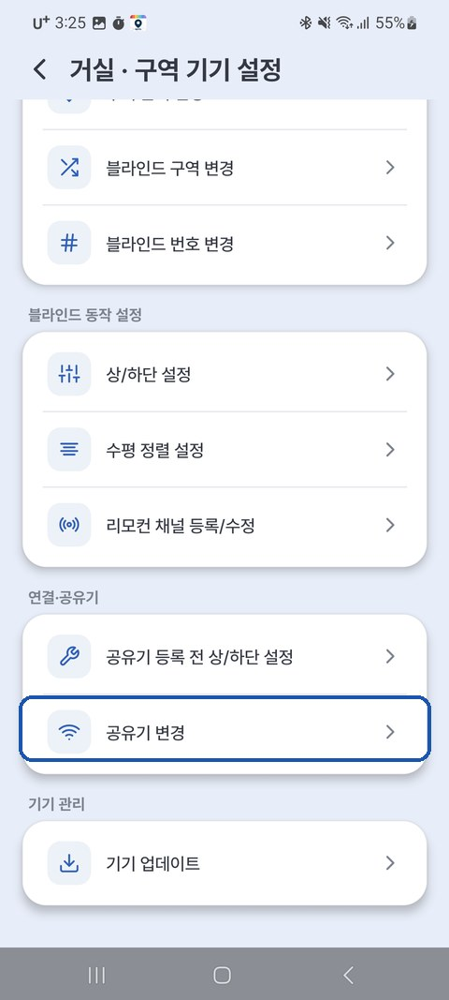

# 6. Changing the Wi-Fi Router

If you've replaced your router with a new one, or your Wi-Fi name or password has changed, your blind can't connect to the internet. When this happens, just **re-enter the updated Wi-Fi information on the device**.

---

## When You'll Need This

- When you've **replaced your internet router with a new one**
- When you've **changed your Wi-Fi name or password**
- When you've moved and are using a **different router**

> If the new router keeps the same name and password, it **reconnects on its own**, so this process isn't needed.

---

## How to Change It

1. **⚙** next to the zone name → **[Zone Device Settings]** → **[Change Wi-Fi Router]**
2. Follow the guidance → enter the **new Wi-Fi name and password**
3. Wait a moment for the **connection to the new router to complete**

{ width="300" }

> 💡 The **[Upper/Lower Limit Setup before router registration]** option in the same menu is for when you want to set the upper/lower limits first, without a Wi-Fi connection.

> 💡 The new Wi-Fi must also be **2.4GHz**. (not `...5G`)

---

## When It's Not Working

| Symptom | Solution |
|---|---|
| Still no connection after changing | Double-check the new Wi-Fi password → try again |
| Blind is unresponsive | Unplug the blind, plug it back in, and try again after 1 minute |
| Still not working | Reset the device (hold the button on the unit for 5 seconds) and start over from [2. Register Device](02_앱_등록하기.md) |
