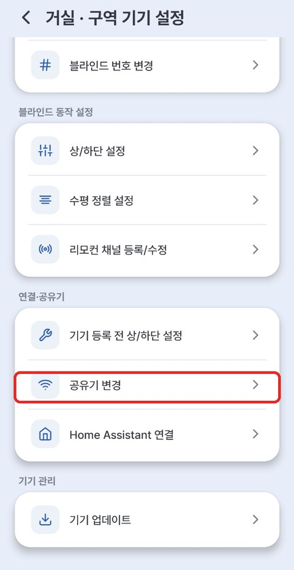

# 6. 공유기(WiFi) 변경

공유기를 새것으로 바꿨거나, WiFi 이름·비밀번호가 바뀌면 블라인드가 인터넷에 연결되지 못합니다. 이럴 때 **변경된 WiFi 정보를 기기에 다시 입력해 주면** 됩니다.

---

## 이럴 때 필요해요

- 인터넷 공유기를 **새 제품으로 교체**했을 때
- WiFi **이름이나 비밀번호를 변경**했을 때
- 이사해서 **다른 공유기**를 쓸 때

> 같은 이름·비밀번호 그대로의 새 공유기라면 **저절로 다시 연결**되니, 이 과정이 필요 없습니다.

---

## 바꾸는 방법

1. 구역 이름 옆 **⚙** → **[구역 기기 설정]** → **[공유기 변경]**
2. 안내에 따라 진행 → **새 WiFi 이름·비밀번호** 입력
3. 잠시 기다리면 **새 공유기로 연결 완료**

{ width="300" }

> 💡 같은 메뉴의 **[공유기 등록 전 상/하단 설정]** 은 WiFi 연결 없이 상/하단부터 잡고 싶을 때 사용합니다.

> 💡 새 WiFi도 **2.4GHz**여야 합니다. (`...5G` 말고)

---

## 공유기만 바뀌어 기기가 끊겼을 때 (AP 모드 자동 복귀)

공유기만 바꿔서 기기가 기존 WiFi를 못 찾으면, **잠시 기다리면 기기가 스스로 설정 모드(AP)로 돌아옵니다.**
폰/PC의 **WiFi 목록에 `EZS...`로 시작하는 이름**이 다시 보이면 준비된 것입니다.

1. 기기 WiFi(`EZS...`)가 목록에 뜰 때까지 **1~2분 기다립니다.** (전원을 뺐다 꽂으면 더 빨리 뜹니다)
2. 그 **`EZS...` WiFi에 접속**한 뒤, 아래 둘 중 하나로 설정 화면에 들어갑니다.
    - **이지롤 앱** — 앱의 기기 등록/공유기 변경 안내를 따라 진행
    - **브라우저** — 주소창에 **`192.168.4.1`** 입력 *(구글 크롬 권장)*
        - 기기 WiFi 비밀번호는 **`u67184`** + **기기 이름 끝 3자리**입니다. (예: 이름이 `EZS...123` → `u67184123`)
3. **새 공유기(WiFi) 이름·비밀번호**를 입력합니다.
    - **HA(Home Assistant)로 쓰던 기기**라면, 같은 설정 화면에서 **[Home Assistant]** 를 눌러 **새 WiFi + HA 브로커 정보**를 함께 입력하세요. → [HA 연동 · 2. 기기 연결하기](../ha/02_기기_연결하기.md)
4. **[저장하고 연결]** → 새 공유기로 자동 연결됩니다.

!!! success "상·하단(리미트) 설정과 현재 위치는 그대로 유지됩니다"

    공유기(와 HA) 정보만 다시 입력하면 되고, **리미트를 다시 잡을 필요는 없습니다.**

---

## 잘 안 될 때

| 증상 | 해결 |
|---|---|
| 변경 후에도 연결 안 됨 | 새 WiFi 비밀번호를 다시 확인 → 재시도 |
| 블라인드가 응답 없음 | 블라인드 전원을 뺐다 꽂고 1분 후 재시도 |
| 그래도 안 되면 | 기기를 초기화(본체 버튼 5초 길게)하고 [2. 기기 등록하기](02_앱_등록하기.md)부터 새로 |
