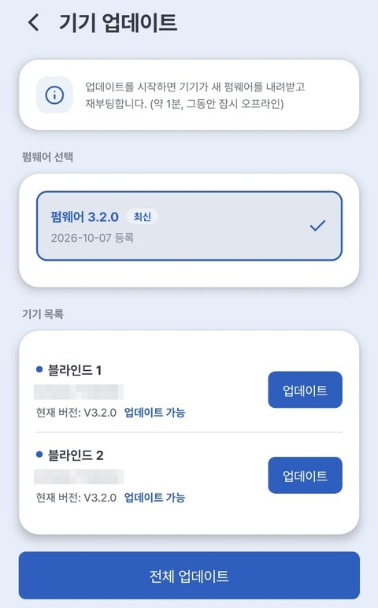

# 7. Device Update

Every now and then a **new-feature or stability update** is released. You can easily update to the latest version in the app.

---

## How to Update

1. Tap the **⚙** next to the zone name → **[Zone device settings]** → **[Firmware update]**
2. If you see **"Update available"**, tap **[Update]** for each device, or **[Update all]** (when there are 2 or more devices)
3. ⚠️ **Do not turn off the power** while it's in progress. (About 1–2 minutes; briefly offline during that time)
4. When finished, the blind **restarts → done!**

{ width="300" }

| Display | Meaning |
|---|---|
| **Up to date** next to the version · gray **[Up to date]** button | Already latest — nothing to do |
| **Update available** next to the version · **[Update]** button | Tap to update to the latest |
| **Current: —** (no label) | The version hasn't been read yet — check that the device is online, then reopen the screen |

---

> ⚠️ **Cautions during the update**
>
> - **Do not turn off or unplug the power** while it's in progress.
> - The blind must be **connected to the internet (your home Wi-Fi)**.
> - A brief unresponsive moment is normal — it restarts automatically when done.

> 💡 Updates aren't mandatory, but they're recommended since they include new features and stability improvements.

> 💡 **Home Assistant Hybrid integration** (use alongside the app) requires firmware **V3.2.0 or later**. Check the current version under **[Zone device settings] → [Device info] → Firmware**.
