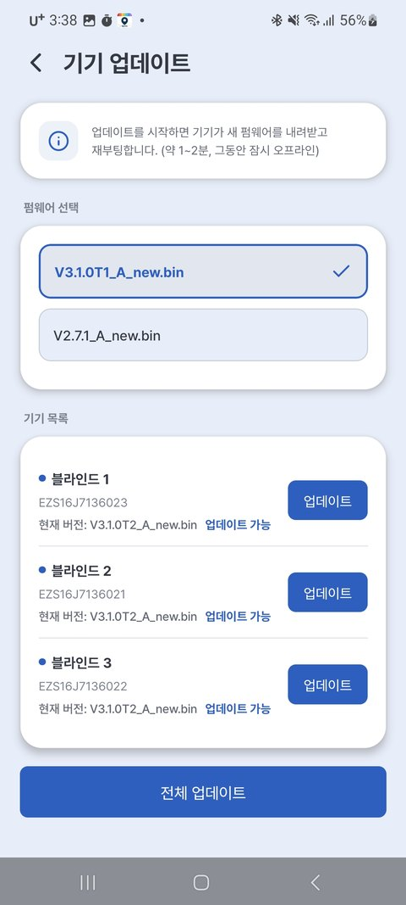

# 7. 기기 업데이트

가끔 **새 기능·안정화 업데이트**가 나옵니다. 앱에서 간단히 최신으로 올릴 수 있습니다.

---

## 업데이트 방법

1. 구역 이름 옆 **⚙** → **[구역 기기 설정]** → **[기기 업데이트]**
2. **"업데이트 가능"** 이 보이면 기기별 **[업데이트]**, 또는 **[전체 업데이트]**
3. ⚠️ 진행 중에는 **전원을 끄지 마세요.** (약 1~2분, 그동안 잠시 오프라인)
4. 완료되면 블라인드가 **재시작 → 끝!**

{ width="300" }

| 표시 | 의미 |
|---|---|
| 현재 버전만 표시 | 최신 상태 |
| **업데이트 가능** | 누르면 최신으로 |

---

> ⚠️ **업데이트 중 주의**
> - 진행 중 **전원을 끄거나 뽑지 마세요.**
> - 블라인드가 **인터넷(집 WiFi)에 연결**돼 있어야 합니다.
> - 잠깐 응답이 없어도 정상 — 완료 후 자동 재시작됩니다.

> 💡 업데이트는 필수는 아니지만, 새 기능과 안정성 개선이 포함되므로 권장합니다.
