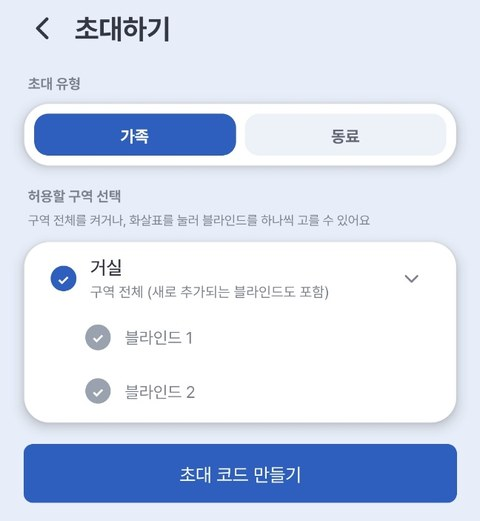
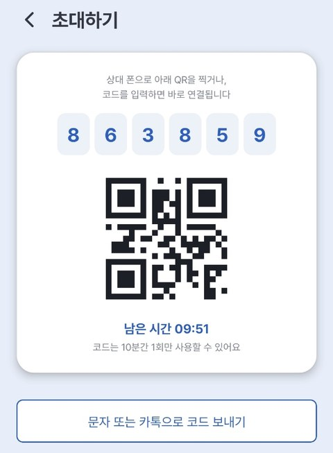
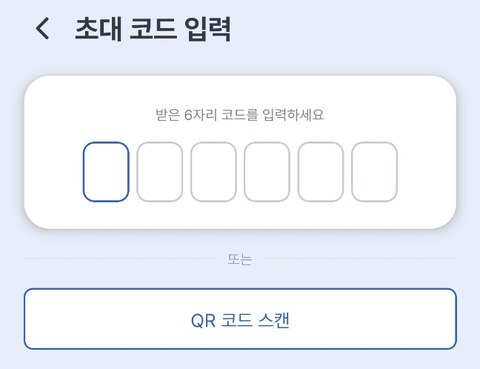
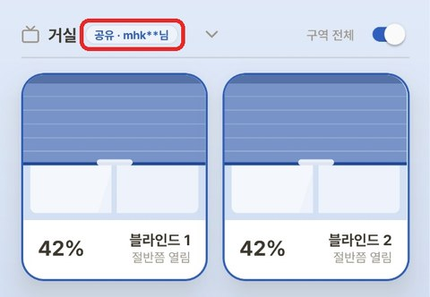
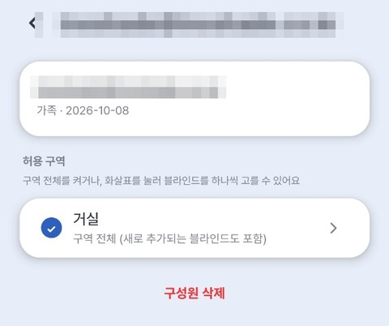

# Add Members (Share with Family & Colleagues)

With a single **invite code**, you can invite family or colleagues to **control your blinds together**.
You can share a **whole zone**, or pick **individual blinds** one by one.

---

## Good to know first

- You can open **Manage Members** straight from the **👥** icon at the top of the main screen (next to the 🕐 alarm icon). It's the same screen as menu **≡** (Settings screen) → **[Manage Members]**.
- Members can only see and control the **zones and blinds the owner allows**.
- Members can also create **schedules (alarms)** — they appear as "Created by ○○" in the list.
- You can invite up to **5 members**.
- The invite code is **6 digits** and works **once, within 10 minutes**.
- **Only the device owner (the inviter) can connect or disconnect Home Assistant.** Member accounts don't see that menu. ([Home Assistant integration](../ha/index.md))
- **SmartThings and Google Home can also be linked only with the owner's account.** If you link with a member account, the blinds shared with you won't appear. ([SmartThings](../st/index.md) · [Google Home](../google/index.md))

---

## ① Invite a member (blind owner)

1. Tap **👥** at the top of the main screen to open the **Manage Members** screen (or menu **≡** (Settings screen) → **[Manage Members]**)
2. **[+ Invite]**

    ![Manage Members — [+ Invite]](../images/share/share_01_manage.jpg){ width="300" }

3. Choose the **invite type** — **Family** or **Colleague**
4. **Select zones to share**
    - Turn on **Whole zone** to share every blind in that zone (including blinds added later)
    - Or tap the arrow (>) on the right of a zone to pick **individual blinds** (N/M selected)

    { width="300" }

5. **[Create invite code]** → a **6-digit code and QR** appear
6. Send it with **[Send code by text or messenger]**

    { width="300" }

> 💡 The code is valid **once, for 10 minutes**. If it expired, tap **[Create new code]**.

---

## ② Accept an invite (invited person)

1. **Sign in to the EasyRoll app** (if you don't have it, [install & sign up](02_앱_설치_회원가입.md) first)
2. Tap **👥** at the top of the main screen → **[Enter invite code]** (or menu **≡** (Settings screen) → **[Manage Members]** → **[Enter invite code]**)
3. Enter the **6-digit code** you received or **[Scan QR code]** — it connects **automatically** (if it doesn't, tap **[Connect]** at the bottom)

    { width="300" }

4. Once connected, the shared zone appears on your main screen labeled **"Shared · ○○"**.

    { width="300" }

> ⚠️ **If the code doesn't work** — it may be **expired (over 10 minutes)**, **entered incorrectly**, or it's **your own code** (which can't be used). After several failures, **try again later**.

---

## Using it together

| Role | Can do |
|---|---|
| **Member** | **Control** allowed zones/blinds · **create schedules (alarms)** |
| **Owner** | **Revoke access · remove members** anytime |

> 💡 A member's schedules appear as **"Created by ○○"** in the list.

> ⚠️ When you **revoke, unshare, or remove**, the schedules that member created for that blind/zone are **deleted together**.

---

## Managing (blind owner)

Tap **👥** at the top of the main screen (the **Manage Members** screen) and select a member to see their **Allowed zones** and **[Remove member]**.

{ width="300" }

| To do | How |
|---|---|
| Turn off one zone | In the member's **Allowed zones**, **uncheck** that zone → **[Confirm]** |
| Take back one blind | In the member's **Allowed zones**, tap the arrow (>) on the right of the zone, **uncheck** the blind → **[Confirm]** |
| Remove a member | Select the member → **[Remove member]** |

> 💡 If the zone is shared as a **Whole zone**, you can't turn off just one blind. Turn off the zone first (the member's schedules for that zone are deleted), then pick only the blinds to keep.

> ⚠️ In every case, the related schedules that member created are **deleted together**.

---

## Leaving a share (invited person)

Tap **👥** at the top of the main screen → in **Shared with me**, tap **[Leave]**.

![Shared with me — [Leave]](../images/share/share_07_leave.jpg){ width="300" }

> After leaving, you can no longer control that zone, and **the schedules you made for it are deleted**.

---

:material-phone-in-talk: **Customer Center** 031-358-1016 · Weekdays 09:00 – 18:00

:material-web: **Website** [easyroll.kr](https://easyroll.kr) · Community → Q&A board

