# DIY 전동모터 조립방법

블라인드 상단바에 전동모터를 결합하는 과정입니다. 십자드라이버 하나면 충분해요.

---

## 조립·설치 전 꼭 읽어주세요

!!! danger "설치 전 체크리스트"

    - **먼저 블라인드를 위로 말아올린 후**에 조립을 시작해 주세요.
    - 기본은 실내에서 본 기준, 블라인드 **오른쪽에 모터를 조립**하는 것입니다.
        - **왼쪽에 설치하시는 경우**, 조립 후 앱의 **상/하단 설정 페이지에서 반드시 [모터방향전환] 버튼을 눌러** 모터 방향을 변경해 주셔야 합니다. ([2-1. 상/하단 위치 설정](02-1_상하단_위치_설정.md) 참고)
    - **아래 사진에 표시된 전동모터의 캡은 제거하지 마세요.** 캡이 씌워진 상태 그대로 조립하시면 됩니다.
    - 각 모터에 동봉된 **QR코드 카드**를 준비하세요. *(이지롤라이트 해당없음)*
        - 설치할 블라인드가 2개 이상일 경우 QR코드 카드가 섞이지 않도록, 카드에 블라인드 위치나 번호(이름)를 적어주시면 좋아요!
        - 전동모터 오른쪽 하단에 부착된 QR코드와 동일합니다.

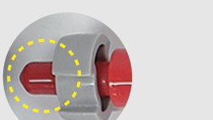{ width="200" }

---

## 조립 순서

사진을 누르면 크게 볼 수 있어요.

**1. 블라인드 상단바 사이드캡의 나사를 푼다.** *(※ 기본은 오른쪽 조립 — 왼쪽 설치 시 위 체크리스트 참고)*

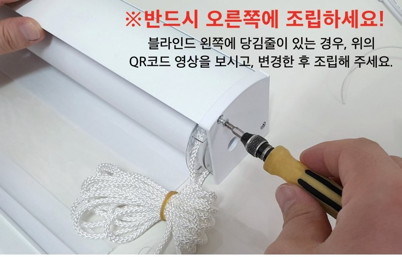{ width="420" }

**2. 사이드캡을 열고, 상단바를 바닥에 눕혀줍니다.**

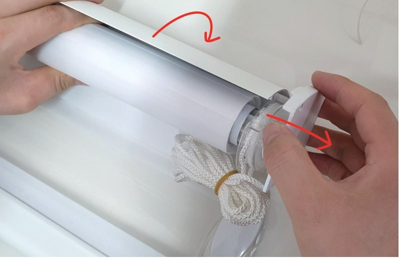{ width="420" }

**3. 블라인드 줄을 제거합니다.**

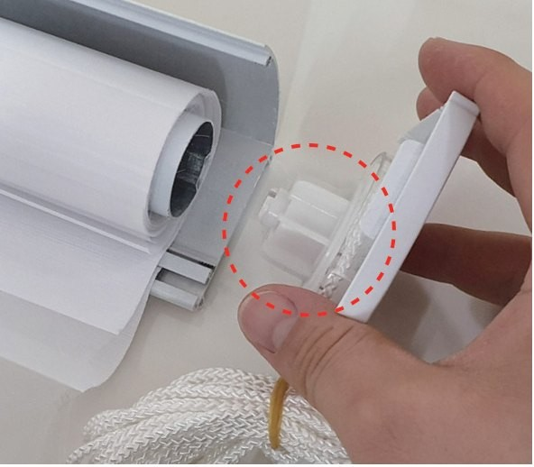{ width="420" }

**4. 전동모터 측면의 홈이 파인 곳에 블라인드 상단바의 사이드캡을 결합합니다.**

> ※ 사이즈가 맞지 않아 유격이 발생한 경우: **'부싱'을 추가로 끼운 후에** 전동모터를 결합하세요.

상단바 종류에 맞는 탭을 선택하세요:

=== "상단바 박스형"

    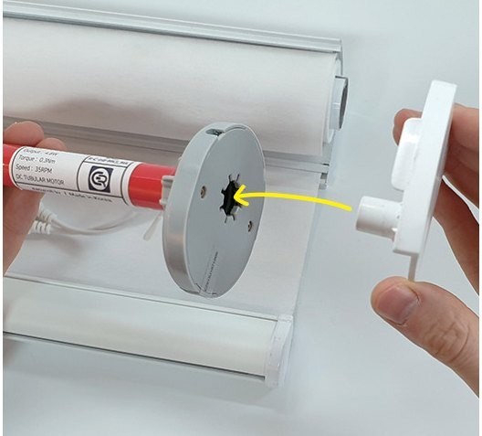{ width="260" }
    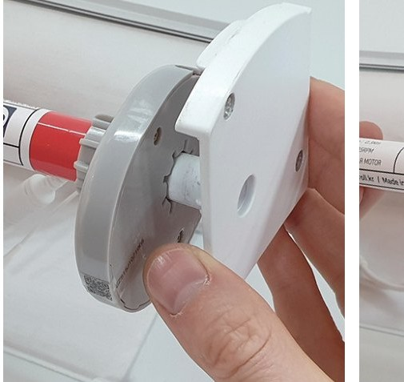{ width="260" }
    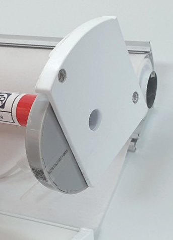{ width="260" }

    !!! warning "박스형 · 유격 발생 시 부싱 결합"

        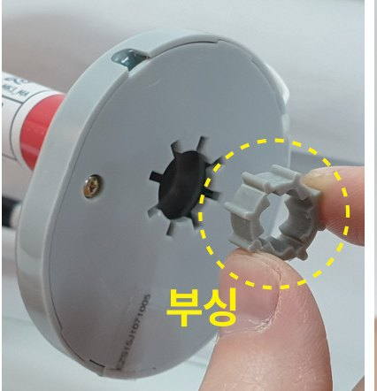{ width="300" }
        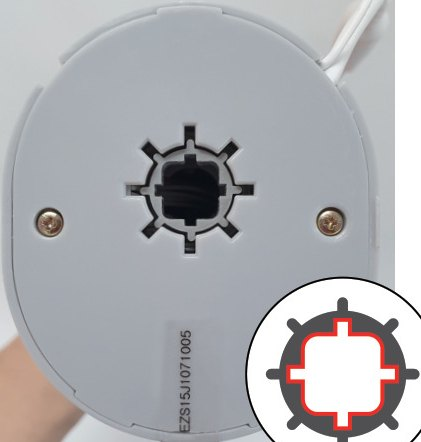{ width="300" }

        **＋ 십자(＋) 모양이 되도록 부싱을 끼워주세요.**

=== "상단바 오픈형"

    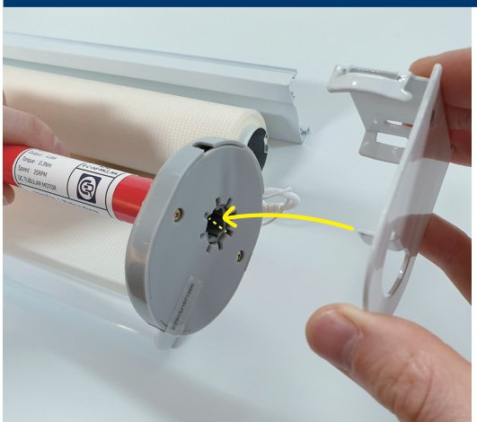{ width="260" }
    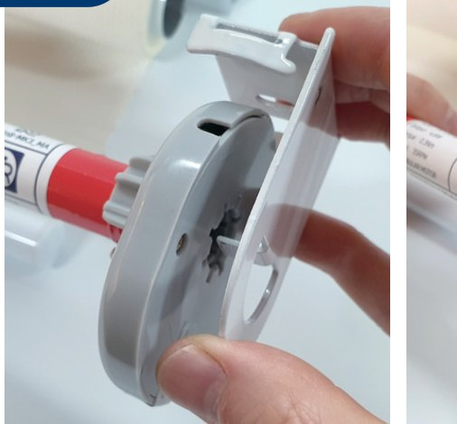{ width="260" }
    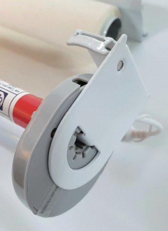{ width="260" }

    !!! warning "오픈형 · 유격 발생 시 부싱 결합"

        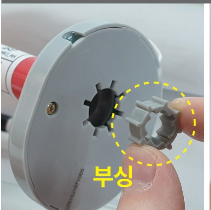{ width="300" }
        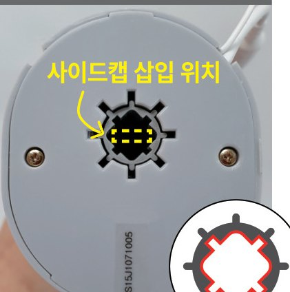{ width="300" }

        **✕ 톱니(✕) 모양이 되도록 사이드캡 삽입 위치에 부싱을 끼워주세요.**

**5. 먼저, 가지고 계신 블라인드의 파이프 모양을 확인합니다.**

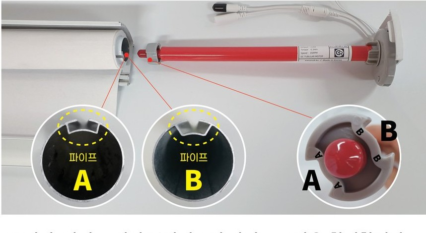{ width="420" }

- 파이프 **A타입** → 전동모터 **A위치**에
- 파이프 **B타입** → 전동모터 **B위치**에

*※ 전동모터에 A/B 표기되어 있습니다.*

**6. 확인한 블라인드 파이프를 전동모터 A/B 위치에 맞게 돌린 다음, 전동모터를 파이프 안으로 밀어 넣어줍니다.** *(※ 모터의 캡은 제거하지 마세요! 캡이 씌워진 상태 그대로 넣어줍니다.)*

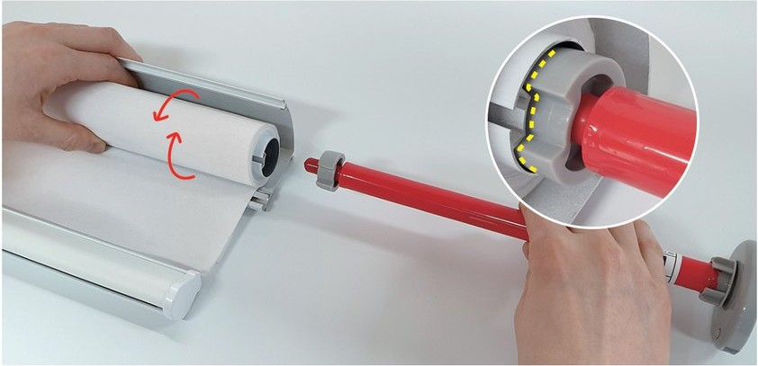{ width="420" }

**7. 아이들러도 파이프 모양에 잘 맞춰서 (돌려가며) 넣어줍니다.**

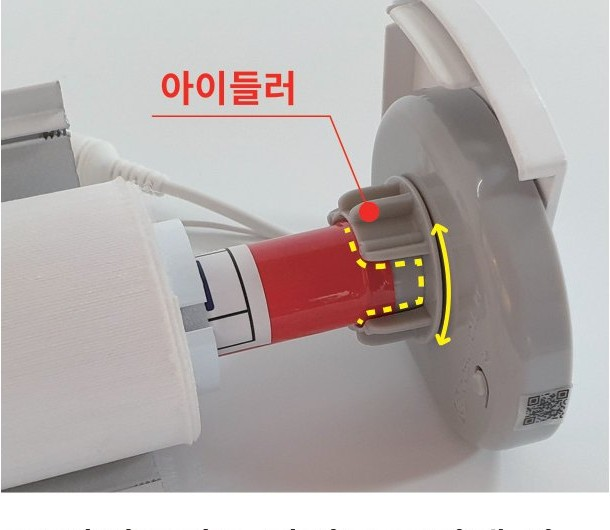{ width="300" }

**8. 눕혀 놓은 상단바를 원위치로 세우고, 사이드캡을 닫습니다.**

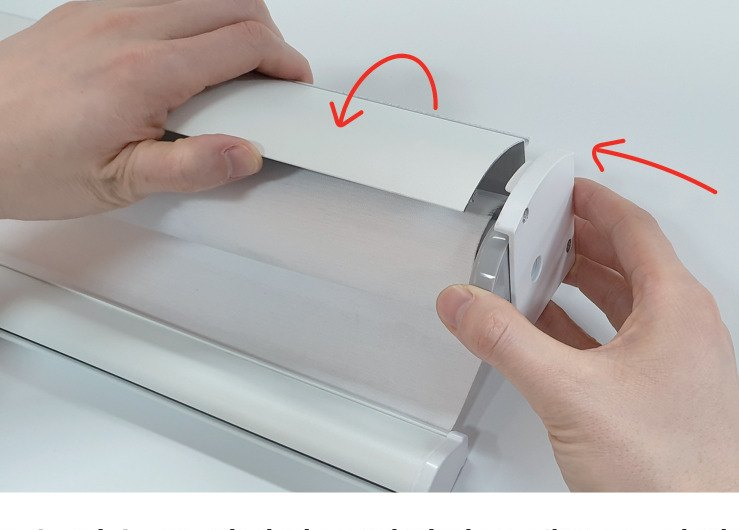{ width="300" }

**9. 나사못으로 고정합니다. — 모터 조립 완료!** *(※ 나사를 너무 세게 조이지 마세요! 모터 속도 저하의 원인이 됩니다.)*

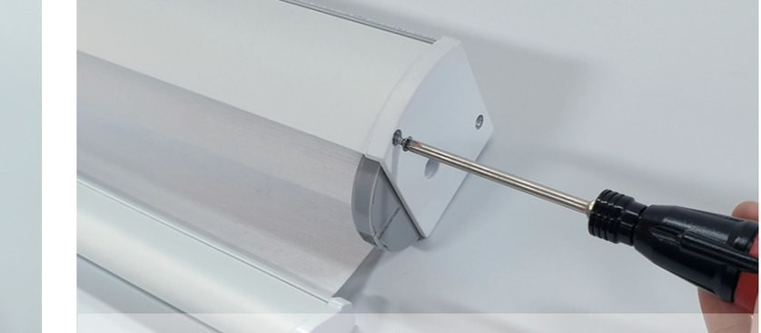{ width="300" }

!!! info "아래 전원 연결까지 확인한 뒤 블라인드를 설치합니다."

    **※ 반드시 모든 설치가 완료된 후에 어댑터(전원플러그)를 콘센트에 꽂아주세요.**

---

## 전원 연결 방법

설치하는 블라인드 수량에 맞는 탭을 선택하세요.

=== "블라인드 1개 설치"

    **연결 구성**

    

    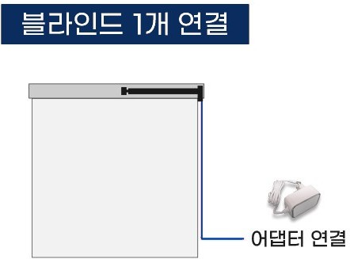

    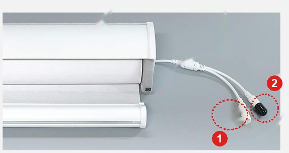

    

    1. **①번에 어댑터를 연결합니다.**
    2. **②는 상단바로 올리거나 블라인드 천과 최대한 멀리 고정 시켜주세요.** *(※ 보호캡 제거하지 마세요!)*
        - 원단과 닿을 경우, 정전기가 발생하여 오작동의 원인이 됩니다.

=== "2개 이상 연결창 설치"

    **연결 구성**

    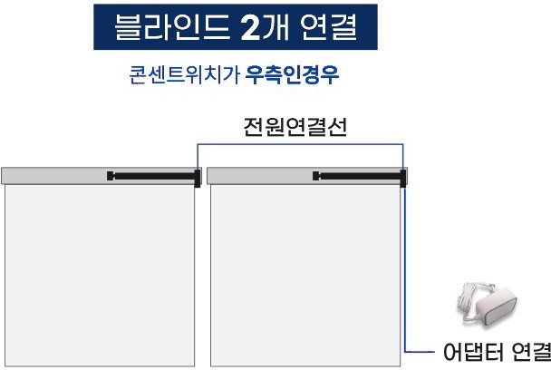{ width="480" }

    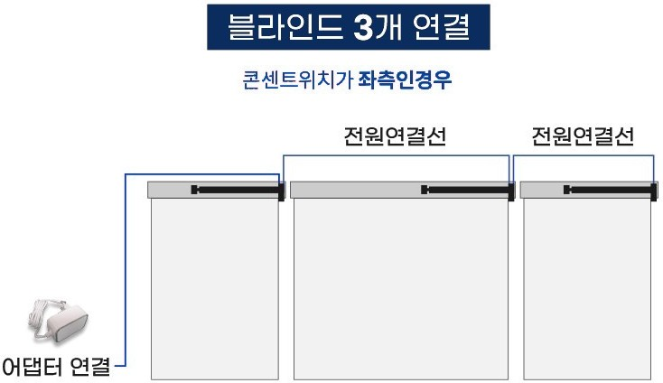{ width="480" }

    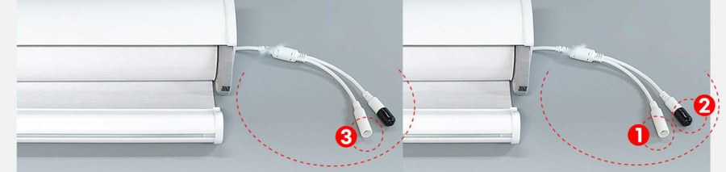{ width="560" }

    1. **①번에 어댑터를 연결합니다.** *(※ 콘센트와 가까운쪽 블라인드에 연결하세요.)*
    2. **②번의 보호캡을 제거하고 ②와 ③에 전원연결선을 연결합니다.** *(※ 연결 후 남은 보호캡 1개는 제거하지 마세요!)*
    3. **연결 부위는 상단바로 올리거나 블라인드 천과 최대한 멀리 고정 시켜주세요.**
        - 원단과 닿을 경우, 정전기가 발생하여 오작동의 원인이 됩니다.

!!! tip "콘센트 위치 · 선 정리"

    - **콘센트 위치는 좌측·우측 모두 설치 가능합니다.** 콘센트와 가까운 쪽 전동모터에 어댑터를 연결하면 됩니다.
    - 어댑터는 기본 **1.2m** 제품을 제공하며, **전원연결선으로 길이를 연장**할 수 있습니다.
    - 전원연결선은 **어댑터가 들어있는 베이직 패키지에 5m**, **추가 모터에는 3m** 연결선이 제공됩니다.
    - **선 정리는 상단바 위쪽으로 올리거나 뒷쪽으로** 정리하세요!

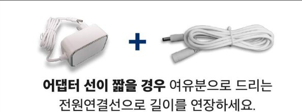{ width="300" }

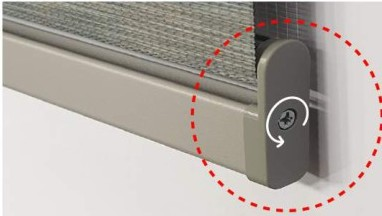{ width="300" }

> **콤비블라인드**는 하단바에 고정된 나사를 **살짝만 풀어주세요!** 너무 꽉 조여져 있으면 봉이 돌아가지 않아 정전기·오작동의 원인이 됩니다.

---

!!! success "블라인드 설치 완료 후, 모바일앱 제품등록을 해주셔야 작동됩니다!"

    설치를 마쳤다면 [1-2. 앱 설치와 회원가입](02_앱_설치_회원가입.md)부터 이어서 진행해 주세요.

