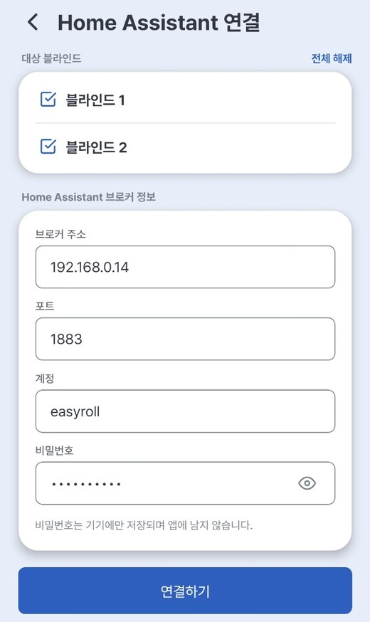
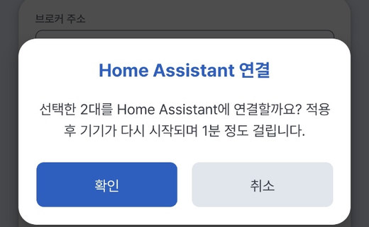
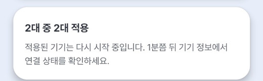
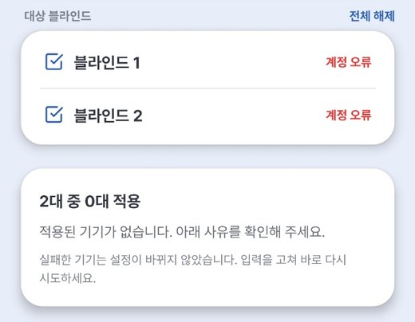
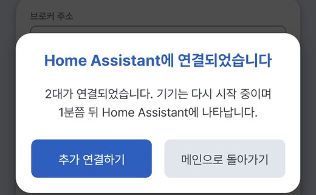
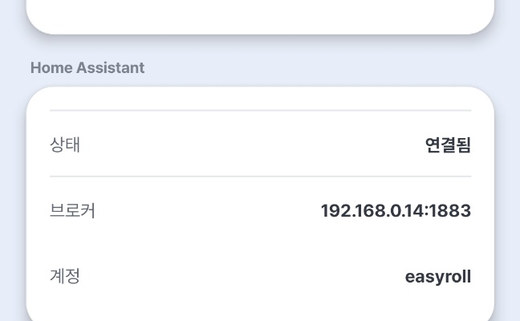
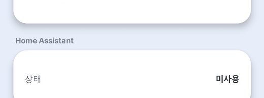

# 2. Connecting the Device

There are two ways to connect to HA. **Method ① Connect from the app (Hybrid) is recommended** — it's the simplest to set up, and even if the internet goes down, HA can still control it locally, and even if HA is off you keep control via the app as long as the internet is connected.

| Method | How | Result |
|---|---|---|
| **① From the app ★Recommended** | Register the device in the EasyRoll app → **[Home Assistant]** in **[Zone device settings]** | **Hybrid**: app + HA **at the same time** (independent of each other) |
| ② Device setup page directly | **Type the device's IP** into a browser and enter the HA info on the setup page | Hybrid or **HA only** (no app control) — for use without the app / PC environments |

> ℹ️ The **[Use as HomeAssistant]** button that used to be on the app's start screen has been **removed.** In the app, **register the device first**, then connect HA from **[Zone device settings]** (Method ①).

!!! success "Why is Method ① (Hybrid) recommended?"

    - **Double safety** — Even if the internet goes down, HA can still control it locally, and even if HA is off you keep control via the app as long as the internet is connected. (The two connections are **independent**.)
    - **Simple setup** — register the device with the EasyRoll app, then connect several devices **at once, per zone** from the app's **[Home Assistant]** screen. Wrong input is reported immediately.
    - **Keep all app features** — alarms, schedules, member sharing and HA automations, together.
    - Requires firmware **V3.2.0 or later** (see the app's **Device info → Firmware**) → update via [7. Device Update](../easyroll/09_기기_업데이트.md)

---

## Method ① Connect from the app — Hybrid (app + HA together) ★Recommended

From the EasyRoll app you connect **several devices at once, per zone**. If an entry is wrong, the device reports it before saving, so a failed attempt changes nothing.

> ℹ️ The screenshots show the Korean app. On a phone set to English, the app shows the English labels used below; the Korean in parentheses matches the screenshots.

### Step 1 — Register the device with the EasyRoll app

If the device isn't registered in the app yet, register it first. Multiple devices can be done at once.

→ [User Guide 2. Register Device](../easyroll/02_앱_등록하기.md) · [2-1. Set Upper/Lower Limits](../easyroll/02-1_상하단_위치_설정.md)

If you already use the device in the app, skip this step. If you just registered it, wait until the device shows **Connected** (연결됨, online) before continuing.

### Step 2 — Zone device settings → [Home Assistant] {#step-2--zone-device-settings--home-assistant-연결}

1. On the main screen, tap **⚙** next to the zone name → **[Zone device settings]** (구역 기기 설정) → **[Home Assistant]** (Home Assistant 연결)
    ![Main screen — ⚙ menu next to the zone name: [Zone device settings]](../images/ha/app_ha_01_zone_menu.jpg){ width="300" }
    ![Zone device settings — [Home Assistant]](../images/ha/app_ha_02_settings_menu.jpg){ width="300" }
2. Under **Target blinds** (대상 블라인드), select the devices to connect. To connect the whole zone, tap **[Select all]** (전체 선택).
3. Enter the **Home Assistant broker** (Home Assistant 브로커 정보) details.

    | Field | Value |
    |---|---|
    | Broker address (브로커 주소) | IP of the HA machine (e.g. `192.168.0.14`) |
    | Port (포트) | `1883` |
    | Username / Password (계정 / 비밀번호) | The MQTT account you created in [Document 1](01_시작하기_준비물.md) |

    > 💡 The password is **stored on the device only — it is not kept in the app.** Tap the 👁 icon to reveal what you typed.

    > 💡 The username in the screenshot (`easyroll`) is only an example. Enter the account you created in [Document 1](01_시작하기_준비물.md) (e.g. `easyroll1`).

    { width="330" }

4. Tap **[Connect]** (연결하기) → on "Connect N blind(s) to Home Assistant?", tap **[Confirm]** (확인)
    { width="300" }

!!! info "I can't see this menu, or it won't connect"

    - It is shown **only to the device owner** (the account that registered it). Shared member accounts cannot connect to HA.
    - If the Home Assistant item in **Device info** shows **Not supported on this device** (지원하지 않는 기기), the firmware is below V3.2.0.
    - Even if it shows **Not used** (미사용), a device with firmware **below V3.2.0** (V2.9.7–V3.1.x) cannot connect to HA, and the result ends in **No response**. Check **Firmware** in Device info.
    - In both cases, first update to **V3.2.0 or later** via [7. Device Update](../easyroll/09_기기_업데이트.md), then try again.

### Step 3 — Read the result

The device **actually connects to the HA broker before saving** (1–2 s). A result is shown for each device.

| Shown | Meaning | What to do |
|---|---|---|
| **N of N applied** (N대 중 N대 적용) · **Done** (완료) | Verified → the device is restarting (about 1 min) | Just wait |
| **Cannot reach** (서버 연결 불가) | Wrong broker address/port, or HA (the broker) is off | Check the address, port and that the broker is running |
| **Login failed** (계정 오류) | MQTT account or password mismatch | Check the account/password |
| **No response** (응답 없음) | The device didn't answer within 10 s (device off, or firmware below V3.2.0) | Check device power/Wi-Fi and retry. If it keeps showing **No response**, check **Firmware** in Device info → if below V3.2.0, do [7. Device Update](../easyroll/09_기기_업데이트.md) and retry |

{ width="300" }

> ⚠️ **Failed devices are left unchanged.** Fix the input and simply try again.

{ width="300" }

On success, a **Connected to Home Assistant** (Home Assistant에 연결되었습니다) popup appears.

- **[Connect more]** (추가 연결하기) — connect other devices **in the same zone** next. (The broker info is kept.)
- **[Back to home]** (메인으로 돌아가기) — returns to the main screen.

{ width="300" }

> 💡 For devices in **another zone**, go back to the main screen and tap that zone's **⚙** → **[Zone device settings]** → **[Home Assistant]**. You'll need to **enter the broker info again**. (The port is pre-filled with `1883`.)

### Step 4 — Verify

- **App**: ⚙ → **[Zone device settings]** → **[Device info]** → if the **Home Assistant** item shows **Connected** (연결됨) with the broker/account, it worked. App control works as usual.
    { width="300" }
- **HA**: the blind (EZS...) is **registered automatically** under Settings → Devices & Services → MQTT (about 1 min after the restart). → [Verify the connection](#verify-the-connection)

> 💡 To **disconnect** from HA, select the devices on the same screen → **[Disconnect from Home Assistant]** (Home Assistant 연결 해제). The device goes back to app-only and its HA registration is cleaned up automatically. Afterwards the device info shows **Not used** (미사용).

{ width="300" }

---

## Method ② Open the device setup page directly (type the IP in a browser)

For environments where the app can't be used (PC only, or running with HA alone). Follow whichever matches the device's state.

> ℹ️ The device's own setup pages are shown **in Korean only**. Below, each on-screen label is given in Korean, followed by its meaning in English.

### ②-A A device already registered in the app — `http://<blind IP>:20318/hasetup`

1. **Find the blind's IP** — EasyRoll app **[Zone device settings] → [Device info] → Device IP**
    - **If the app can't show the IP** (e.g. an HA-only device): look in your router's admin page, in the **connected devices (DHCP) list**, for a device whose name starts with `EZS`.
    - If an HA-only device is connected to HA, you can also send `EZS_NETINFO$` from HA and read the `ip:` value in the **`/feedback`** reply. (How to send: [4. Advanced Commands](04_고급_명령어.md))
2. On a phone/PC on the same Wi-Fi, open **`http://<blind IP>:20318/hasetup`** in a browser *(the **Google Chrome** browser is recommended)*
3. Enter the HA broker info in the **HA_Server** box: **브로커 IP** (Broker IP) · **포트** (Port) `1883` · **사용자** (User) · **비밀번호** (Password). (Tap the 👁 icon to reveal the password.)
4. Choose the mode you want.
    - **Hybrid (app + HA)** → ★ **tick [Easyroll 앱과 함께 사용 (서버+HA 동시 연결)]** ("Use with the Easyroll app") → **[HA_Server로 전환·저장]** (Switch to HA_Server · Save)
    - **HA only** (app control stops) → leave the box **unticked** → **[HA_Server로 전환·저장]**
5. The device restarts and **registers automatically in HA**. (With Hybrid, the app keeps working too.)

{ width="330" }

!!! warning "The tick box decides the mode"

    Saving without the tick **disconnects the app and makes it HA only**. To keep using the app, **be sure to tick the box**.
    If that happened, press **[Easyroll_Server로 복원]** (Restore Easyroll_Server) on the same page and try again.

#### Reverting to the EasyRoll app

When you want to disconnect from HA and go back to the EasyRoll app only, press one of the two buttons below.

| Location | Button |
|---|---|
| `.../20318/hasetup` (same page) | **[Easyroll_Server로 복원]** (Restore Easyroll_Server) |
| Bottom of the `.../20318/limitsetup` page | **[Easyroll 모드로 전환]** (Switch to Easyroll Mode) |

> ⚠️ Unlike **[Disconnect from Home Assistant]** in the app, these two buttons **do not remove the device's registration from HA.** For a Hybrid device, the app's **[Disconnect from Home Assistant]** is the cleaner way (it also cleans up the HA registration automatically).

**Device state after switching**

- **A device that was registered in the EasyRoll app** — works right away in the app after a few seconds.
- **A device that was never registered in the app** — after a few minutes, the LED repeats **"blink 3 times → pause 2 seconds"**. (Waiting-for-registration state.)
    - Do a [device registration](../easyroll/02_앱_등록하기.md) in the EasyRoll app to use it.
- **In HA** — the device remains as **"Unavailable"**. Open the blind (EZS...) under HA's **Settings → Devices & Services → MQTT** and **delete** it.
    - If you send `EZS_HADISCOVERY_OFF$` from HA **before** switching, nothing is left behind in HA. → [4. Advanced Commands](04_고급_명령어.md)

### ②-B New device without the app (or a reset device) — `192.168.4.1` (HA only)

For running the blind **with HA only**, without using the EasyRoll app at all. The result is **HA only** (no app control).

> ⚠️ If you also want the app, use **Method ①** (register in the app, then connect) instead.

1. **Power ON the blind** (a small movement and return means it's ready).
2. On your phone/PC, **connect to the blind's Wi-Fi name (EZS...)** in Wi-Fi settings.
    - The password is **`u67184`** + the **last 3 characters of the device name (ID)**.
        e.g. if the device name is `EZS...123`, the password is **`u67184123`**
3. Type **`192.168.4.1`** in your browser's address bar *(the **Google Chrome** browser is recommended)*

A setup screen like the one below appears. Follow the on-screen guidance to **complete 상/하단 설정 (Upper/Lower Limit Setup) first**, then choose a connection method.

{ width="330" }

#### ②-B Step 4 — ⚙ 상/하단 설정 (Upper/Lower Limit Setup) — do this first {#step-4--upperlower-limit-setup--do-this-first}

For the HA position slider (%) to work accurately, you must **first** tell the blind where its "top/bottom" are.
On the home screen, tap **[⚙ 상/하단 설정]** (Upper/Lower Limit Setup).

!!! tip "Skip this if the motor's limits are already set"

    A device whose **Upper/Lower limits were already set in the EasyRoll app** has those values saved in the motor, so there's **no need to set them again.**
    Jump straight to [②-B Step 5 — Enter HA connection info](#step-5--enter-ha-connection-info).

{ width="330" }

1. In **세팅모드** (Setup Mode), use **▲ 올림 / ▼ 내림** (Up/Down) to move to the **top** position you want → **[상단 저장]** (Save Upper)
    - ⚠️ 세팅모드 (Setup Mode) ignores saved limits and keeps moving. **Be sure to press ■ 정지 (Stop) before it reaches the end.**
2. Move to the **bottom** position the same way → **[하단 저장]** (Save Lower) *(order: Upper first → then Lower)*
3. Switch to **일반모드** (Normal Mode) and press ▲/▼ to confirm it stops properly at the saved positions.
4. Use **짧게 이동** (jog) **1단계~4단계** (steps 1–4) for fine adjustment. (The larger the step, the more it moves.)
5. If the direction is reversed, switch between **좌측 모터 / 우측 모터** (Left/Right motor) under **모터 방향** (Motor Direction). (Right by default; the device restarts when changed.)

> 💡 The **현재 위치 / 하단** (Current position / Lower, %) display on screen shows where it is right now.

> 💡 Even after registration, you can reconfigure anytime at `http://<blind IP>:20318/limitsetup`. (To find the blind's IP → [②-A step 1](#②-a-a-device-already-registered-in-the-app--http20318hasetup))

#### ②-B Step 5 — Enter HA connection info {#step-5--enter-ha-connection-info}

Once the limit setup is done, **return to the home screen and tap [Home Assistant]**.

{ width="330" }

| Section | Fields |
|---|---|
| **집 WiFi** (Home Wi-Fi) | SSID (Wi-Fi name) · 비밀번호 (Password) |
| **HA_Server** | 브로커 IP (Broker IP) · 포트 (Port, `1883`) · 사용자 (User) · 비밀번호 (Password) ← the values you noted in [Document 1](01_시작하기_준비물.md) |

> 💡 Tap the 👁 icon in the password field to reveal what you typed.

Tap **[저장하고 연결]** (Save and Connect) and the device restarts, connecting automatically to your home Wi-Fi + HA.

!!! info "It's normal for the screen to freeze or show 'Not connected' right after saving"

    When you save, the blind **turns off its own Wi-Fi (EZS...) and moves to your home Wi-Fi.**
    Because your phone/PC's connection to the device is **dropped automatically**, the browser page may not open or may look like an error. **This is not a malfunction.**

    - Reconnect your phone/PC's Wi-Fi to **your usual home Wi-Fi.**
    - Wait a moment (about 1 minute), then check [Verify the connection](#verify-the-connection) below to see if it registered in HA.

Once connected, the **blind registers automatically in HA.** You don't need to press any extra Add button.

---

## Verify the connection

1. In HA: **Settings → Devices & Services → MQTT** → if the blind (EZS...) appears in the device list, it worked.
2. Test movement with the ▲/▼/■ buttons on the device card.
3. With Hybrid, also confirm it still works **in the EasyRoll app** as usual.

---

## Adding to the dashboard

Connecting registers the device, but to **make it visible on your dashboard (home screen)** you need one more step.
There are two ways — **① Assign an area** is the simplest, and if you want to place it exactly where you like, use **② Add a card**.

### ① Placing the device in the "Living Room" (recommended)

Putting a device in an area (room) lets HA's default dashboard **organize it by room automatically.**

1. **Settings** → **Devices & Services** → the **[Devices]** tab at the top
2. Select the blind (`EZS...`) from the list.
3. Click the **⚙ (gear)** or **[Settings]** on the device info card.
4. Under **Area**, choose **Living Room** and click **[Update]**.
    - If the room you want isn't there, type a name in the box to **create a new one.**
5. Back on the dashboard, the blind appears inside the **Living Room** section.

> 💡 You can also rename the device here (e.g. `EZS...` → **Living Room Blind**). Pick a name that's easy to call in voice commands or automations.

### ② Adding it to the dashboard as a card

Use this when you want to place it in a specific spot on a specific dashboard.

1. On the dashboard screen, click the **✏️ (pencil)** at the top right to enter **edit mode**.
2. Click **[＋ Add Card]**.
3. From the card types, pick **Tile** or **Entities**.
4. In the **Entity** field, type `cover.` and select the blind. (e.g. `cover.ezs16a4106036`)
5. **[Save]** → exit edit mode and the card is placed on the dashboard.

> 💡 The **Tile card** shows open/close/stop buttons in a single row and is the easiest to use.

> 💡 To put several blinds on one card, add multiple blinds to an **Entities card**.

---

## Good to know

- In **Hybrid** (Method ①, or Method ②-A with the box ticked), the EasyRoll app and HA are used **at the same time**. Even if the internet goes down, HA can still control it locally, and even if HA is off you keep control via the app as long as the internet is connected. (The two connections are independent.)
- In **HA only** (Method ②-A unticked · ②-B), **EasyRoll app control stops** while connected to HA. (The remote and buttons always work in any mode.)
- To connect or disconnect HA, use the app's **[Home Assistant]** screen: **[Connect]** / **[Disconnect from Home Assistant]**. (Without the app, use the device setup page `.../20318/hasetup` — if you revert from that page, you must [delete the device in HA yourself](#reverting-to-the-easyroll-app).)
- **If the HA machine's IP changes**, the blind can no longer reach HA. (The device keeps trying to reconnect.) Connect it again with the new address.
    - **Hybrid** — in the app, run ⚙ → **[Zone device settings]** → **[Home Assistant]** again with the new broker address
    - **HA only** — open `http://<blind IP>:20318/hasetup`, enter the new broker IP and account info, and save again **without the tick**. Find the blind's IP in your router's connected devices list ([②-A step 1](#②-a-a-device-already-registered-in-the-app--http20318hasetup)). If you can't find the IP, do a **factory reset** (hold the button 5 seconds) and repeat [②-B](#②-b-new-device-without-the-app-or-a-reset-device--19216841-ha-only) from the start.
- Doing a **factory reset** (hold the button 5 seconds) clears the HA settings and returns the device to its default (EasyRoll app) state. However, the device's registration in HA is not removed, so if you no longer use it in HA, delete the blind (EZS...) yourself under HA's **Settings → Devices & Services → MQTT**.
