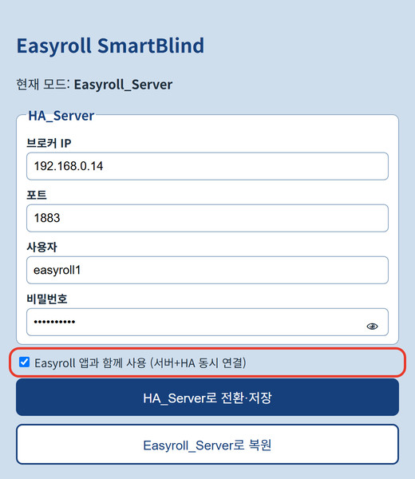
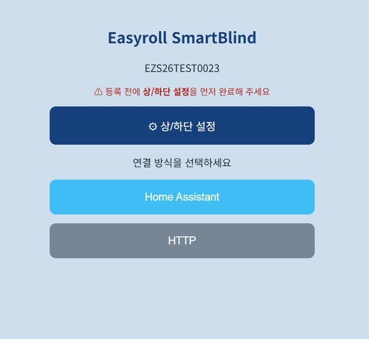
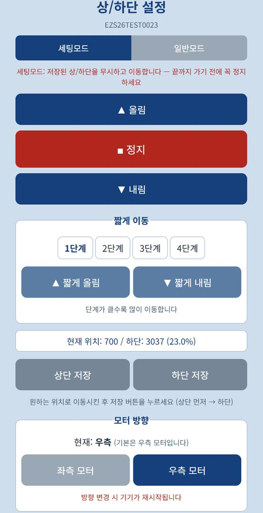
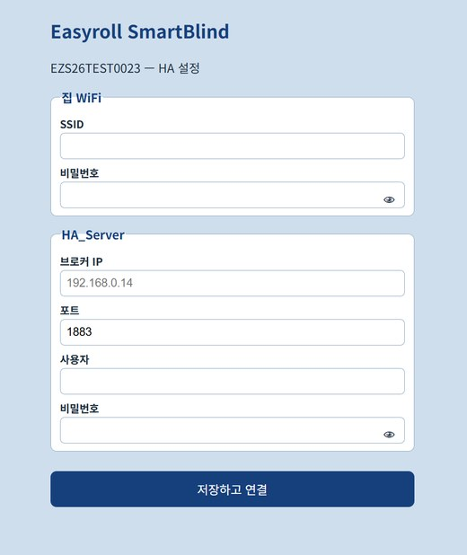

# 2. Connecting the Device

There are three ways to connect. **Method ① Hybrid (app + HA together) is recommended** — it's the simplest to set up, and if either the server or HA has a problem, you keep control through the other.

| Method | Best for | Result |
|---|---|---|
| **① Hybrid ★Recommended** | You want to use both the EasyRoll app and HA | App + HA **at the same time** (independent of each other) |
| ② HA only — new device | You want HA only, without the app (new / reset device) | HA only; no app control |
| ③ HA only — app-registered device | You want to switch an app-registered device to HA only | HA only; app control stops |

!!! success "Why is Hybrid recommended?"

    - **Double safety** — if the EasyRoll server is briefly down, HA keeps controlling locally; if HA is off, the app still works. (The two connections are **independent**.)
    - **Simple setup** — register the device with the EasyRoll app (Wi-Fi, upper/lower limits), then just enter the HA info on a web page and **tick one box**.
    - **Keep all app features** — alarms, schedules, member sharing and HA automations, together.
    - Requires firmware **V3.2.0T4 or later** → check/update via [7. Device Update](../easyroll/09_기기_업데이트.md)

---

## Method ① Hybrid — App + HA together ★Recommended

### Step 1 — Register the device with the EasyRoll app

If the device isn't registered in the app yet, register it first. Multiple devices can be done at once.

→ [User Guide 2. Register Device](../easyroll/02_앱_등록하기.md) · [2-1. Set Upper/Lower Limits](../easyroll/02-1_상하단_위치_설정.md)

If you already use the device in the app, skip this step.

### Step 2 — Open the device setup page

1. **Find the blind's IP** — you can see it in the EasyRoll **app's device info**.
2. On a phone/PC on the same Wi-Fi, open **`http://<blind IP>:20318/hasetup`** in a browser *(**Google Chrome** recommended)*

### Step 3 — Enter the HA info + tick "use with the app"

{ width="330" }

| Field | Value |
|---|---|
| Broker IP | IP of the HA machine (e.g. `192.168.0.14`) |
| Port | `1883` |
| Username / Password | The MQTT account you created in [Document 1](01_시작하기_준비물.md) |

1. Enter the values above. (Tap the 👁 icon in the password field to reveal what you typed.)
2. ★ **Tick [Easyroll 앱과 함께 사용 (서버+HA 동시 연결)]** — "Use with the Easyroll app (server + HA together)".
3. Tap **[HA_Server로 전환·저장]** (Switch to HA_Server · Save).

A message saying it will switch to HA + Easyroll app together appears, and the device **restarts**. (Offline for a few dozen seconds.)

!!! warning "If you forget the tick, it becomes HA only"

    Saving without the tick **disconnects the app and makes it HA only (Method ③)**. To keep using the app, **be sure to tick the box**.
    If that happened, press **[Easyroll_Server로 복원]** (Restore Easyroll_Server) on the same page and try again.

### Step 4 — Verify

- **App**: after a moment, the device works in the app as usual.
- **HA**: the blind (EZS...) is **registered automatically** under Settings → Devices & Services → MQTT. → [Verify the connection](#verify-the-connection)

> 💡 To connect several devices, repeat Steps 2–3 for each one. (The broker info is the same for all.)

---

## Method ② HA only — New device (or a reset device)

For running the blind **with HA only**, without the EasyRoll app. You connect using just a browser — no app needed.

> ⚠️ With this method, **the EasyRoll app cannot control the device.** If you also want the app, use **Method ①** above.

1. **Power ON the blind** (a small movement and return means it's ready).
2. On your phone/PC, **connect to the blind's Wi-Fi name (EZS...)** in Wi-Fi settings.
    - The password is **`u67184`** + the **last 3 characters of the device name (ID)**.
        e.g. if the device name is `EZS...123`, the password is **`u67184123`**
3. Type **`192.168.4.1`** in your browser's address bar *(the **Google Chrome** browser is recommended)*

A setup screen like the one below appears. Follow the on-screen guidance to **complete the Upper/Lower Limit Setup first**, then choose a connection method.

{ width="330" }

### Step 4 ⚙ Upper/Lower Limit Setup — do this first

For the HA position slider (%) to work accurately, you must **first** tell the blind where its "top/bottom" are.
On the home screen, tap **[⚙ Upper/Lower Limit Setup]**.

!!! tip "Skip this if the motor's limits are already set"

    A device whose **Upper/Lower limits were already set in the EasyRoll app** has those values saved in the motor, so there's **no need to set them again.**
    Jump straight to [Step 5 — Enter HA connection info](#step-5--enter-ha-connection-info).

{ width="330" }

1. In **Setup Mode**, use **▲Up / ▼Down** to move to the **top** position you want → **[Save Upper]**
    - ⚠️ Setup Mode ignores saved limits and keeps moving. **Be sure to press ■Stop before it reaches the end.**
2. Move to the **bottom** position the same way → **[Save Lower]** *(order: Upper first → then Lower)*
3. Switch to **Normal Mode** and press ▲/▼ to confirm it stops properly at the saved positions.
4. Use **jog (steps 1–4)** for fine adjustment. (The larger the step, the more it moves.)
5. If the direction is reversed, swap **Left/Right** under **Motor Direction**. (Right by default; the device restarts when changed.)

> 💡 The **Current position / Lower (%)** display on screen shows where it is right now.
> 💡 Even after registration, you can reconfigure anytime at `http://<blind IP>:20318/limitsetup`.

### Step 5 — Enter HA connection info

Once the Upper/Lower Limit Setup is done, **return to the home screen and tap [Home Assistant]**.

{ width="330" }

| Section | Fields |
|---|---|
| **Home Wi-Fi** | SSID (Wi-Fi name) · password |
| **HA_Server** | Broker IP · port (`1883`) · username · password ← the values you noted in [Document 1](01_시작하기_준비물.md) |

> 💡 Tap the 👁 icon in the password field to reveal what you typed.

Tap **[Save and Connect]** and the device restarts, connecting automatically to your home Wi-Fi + HA.

!!! info "It's normal for the screen to freeze or show 'Not connected' right after saving"

    When you save, the blind **turns off its own Wi-Fi (EZS...) and moves to your home Wi-Fi.**
    Because your phone/PC's connection to the device is **dropped automatically**, the browser page may not open or may look like an error. **This is not a malfunction.**

    - Reconnect your phone/PC's Wi-Fi to **your usual home Wi-Fi.**
    - Wait a moment (about 1 minute), then check [Verify the connection](#verify-the-connection) below to see if it registered in HA.

Once connected, the **blind registers automatically in HA.** You don't need to press any extra Add button.

---

## Method ③ HA only — Switch an app-registered device to HA only

Switches to **HA only** without resetting the device. (To keep the app as well, use **Method ①**.)

1. **Find the blind's IP** — you can see it in the EasyRoll **app's device info**.
2. In your browser, go to **`http://<blind IP>:20318/hasetup`** *(the **Google Chrome** browser is recommended)*
3. **Enter the HA broker info** → **leave the [Easyroll 앱과 함께 사용] box unticked** → **[HA_Server로 전환·저장]** (Switch to HA_Server · Save)
4. After the restart, it **registers automatically in HA**. EasyRoll app control then stops.

### Reverting to the EasyRoll app

When you want to disconnect from HA and go back to the EasyRoll app only, press one of the two buttons below. (Same when you want to drop just HA from Hybrid.)

| Location | Button |
|---|---|
| `.../20318/hasetup` (same page) | **[Easyroll_Server로 복원]** (Restore Easyroll_Server) |
| Bottom of the `.../20318/limitsetup` page | **[Easyroll 모드로 전환]** (Switch to Easyroll Mode) |

**Device state after switching**

- **A device that was registered in the EasyRoll app** — works right away in the app after a few seconds. The device **cleans up its HA registration automatically**.
- **A device that was never registered in the app** — after a few minutes, the LED repeats **"blink 3 times → pause 2 seconds"**. (Waiting-for-registration state.)
    - Do a [device registration](../easyroll/02_앱_등록하기.md) in the EasyRoll app to use it.

---

## Verify the connection

1. In HA: **Settings → Devices & Services → MQTT** → if the blind (EZS...) appears in the device list, it worked.
2. Test movement with the ▲/▼/■ buttons on the device card.
3. With Hybrid (Method ①), also confirm it still works **in the EasyRoll app** as usual.

---

## Adding to the dashboard

Connecting registers the device, but to **make it visible on your dashboard (home screen)** you need one more step.
There are two ways — **① Assign an area** is the simplest, and if you want to place it exactly where you like, use **② Add a card**.

### ① Placing the device in the "Living Room" (recommended)

Putting a device in an area (room) lets HA's default dashboard **organize it by room automatically.**

1. **Settings** → **Devices & Services** → the **[Devices]** tab at the top
2. Select the blind (`EZS...`) from the list.
3. Click the **⚙ (gear)** or **[Settings]** on the device info card.
4. Under **Area**, choose **Living Room** and click **[Update]**.
    - If the room you want isn't there, type a name in the box to **create a new one.**
5. Back on the dashboard, the blind appears inside the **Living Room** section.

> 💡 You can also rename the device here (e.g. `EZS...` → **Living Room Blind**). Pick a name that's easy to call in voice commands or automations.

### ② Adding it to the dashboard as a card

Use this when you want to place it in a specific spot on a specific dashboard.

1. On the dashboard screen, click the **✏️ (pencil)** at the top right to enter **edit mode**.
2. Click **[＋ Add Card]**.
3. From the card types, pick **Tile** or **Entities**.
4. In the **Entity** field, type `cover.` and select the blind. (e.g. `cover.ezs16a4106036`)
5. **[Save]** → exit edit mode and the card is placed on the dashboard.

> 💡 The **Tile card** shows open/close/stop buttons in a single row and is the easiest to use.
> 💡 To put several blinds on one card, add multiple blinds to an **Entities card**.

---

## Good to know

- In **Hybrid (Method ①)**, the EasyRoll app and HA are used **at the same time**. If the EasyRoll server is down you still control via HA; if HA is off you still control via the app. (The two connections are independent.)
- In **HA only (Methods ② · ③)**, **EasyRoll app control stops** while connected to HA. (The remote and buttons always work in any mode.)
- Switching modes (Hybrid ↔ HA only ↔ app only) is done on the `.../20318/hasetup` page (tick box / restore button), or with a single command → [4. Advanced Commands](04_고급_명령어.md)
- Doing a **factory reset** (hold the button 5 seconds) clears the HA settings and returns the device to its default (EasyRoll app) state.
