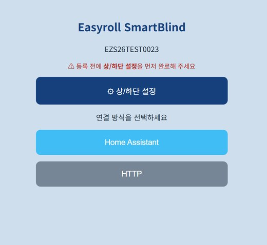
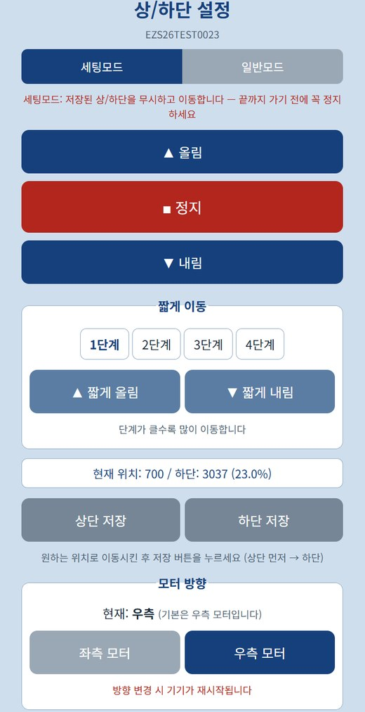
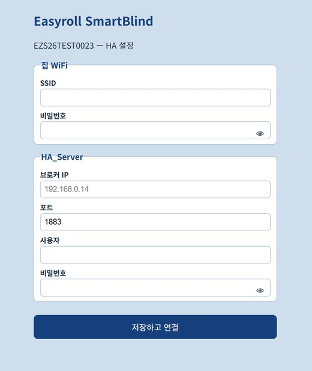

# 2. 기기 연결하기

브라우저만으로 연결합니다 — 별도 앱이 필요 없습니다. 상황에 맞는 방법 하나를 따라 하세요.

---

## 방법 A — 새 기기 (또는 초기화한 기기) ★가장 쉬움

1. **블라인드 전원 ON** (살짝 움직였다 돌아오면 준비 완료)
2. 폰/PC의 **WiFi 설정에서 블라인드 이름(EZS...)에 연결**
    - 비밀번호는 **`u67184`** + **기기 이름(ID)의 마지막 3자리**입니다.
        예) 기기 이름이 `EZS...123` 이면 → 비밀번호는 **`u67184123`**
3. 브라우저 주소창에 **`192.168.4.1`** 입력 *(**구글 크롬** 브라우저를 권장합니다)*

아래와 같은 설정 화면이 나타납니다. 화면 안내대로 **상/하단 설정을 먼저** 완료한 뒤 연결 방식을 선택하세요.

{ width="330" }

### 4단계 ⚙ 상/하단 설정 — 가장 먼저 하세요

HA 위치 슬라이더(%)가 정확히 동작하려면 블라인드의 "맨 위/맨 아래"를 **먼저** 알려줘야 합니다.
첫 화면에서 **[⚙ 상/하단 설정]** 을 누르세요.

!!! tip "이미 상/하단이 설정된 모터라면 건너뛰어도 됩니다"

    이지롤 앱에서 이미 **상/하단 설정을 완료한 기기**는 그 값이 모터에 저장되어 있어, **다시 설정할 필요가 없습니다.**
    바로 [5단계 HA 연결 정보 입력](#5단계-ha-연결-정보-입력)으로 넘어가세요.

{ width="330" }

1. **세팅모드**에서 **▲올림 / ▼내림**으로 원하는 **맨 위** 위치로 이동 → **[상단 저장]**
    - ⚠️ 세팅모드는 저장된 한계를 무시하고 움직입니다. **끝까지 가기 전에 ■정지를 꼭 누르세요.**
2. 같은 방법으로 **맨 아래** 위치로 이동 → **[하단 저장]** *(상단 먼저 → 하단 순서)*
3. **일반모드**로 바꿔 ▲/▼를 눌러 저장된 위치에서 잘 멈추는지 확인합니다.
4. **짧게 이동(1~4단계)** 으로 미세 조정할 수 있습니다. (단계가 클수록 많이 이동)
5. 동작 방향이 반대라면 **모터 방향**에서 **좌측/우측**을 바꿉니다. (기본 우측, 변경 시 기기 재시작)

> 💡 화면의 **현재 위치 / 하단 (%)** 표시로 지금 어디에 있는지 확인할 수 있습니다.
> 💡 등록을 마친 뒤에도 `http://<블라인드IP>:20318/limitsetup` 으로 언제든 다시 설정할 수 있습니다.

### 5단계 HA 연결 정보 입력

상/하단 설정을 마쳤으면 **처음 화면으로 돌아와 [Home Assistant]** 를 누릅니다.

{ width="330" }

| 구분 | 입력 항목 |
|---|---|
| **집 WiFi** | SSID(WiFi 이름) · 비밀번호 |
| **HA_Server** | 브로커 IP · 포트(`1883`) · 사용자 · 비밀번호 ← [1번 문서](01_시작하기_준비물.md)에서 메모한 값 |

> 💡 비밀번호 칸의 👁 아이콘을 누르면 입력한 값을 확인할 수 있습니다.

**[저장하고 연결]** 을 누르면 기기가 재시작하며 집 WiFi + HA에 자동 연결됩니다.

!!! info "저장 직후 화면이 멈추거나 '연결 안 됨'으로 보이는 것은 정상입니다"

    저장하면 블라인드가 **자기 WiFi(EZS...)를 끄고 집 WiFi로 옮겨갑니다.**
    폰/PC와 기기의 연결이 **자동으로 끊어지기 때문에**, 브라우저에는 페이지가 열리지 않거나 오류처럼 보일 수 있습니다. **고장이 아닙니다.**

    - 폰/PC의 WiFi를 **원래 쓰던 집 WiFi로 다시 연결**해 주세요.
    - 잠시(약 1분) 기다린 뒤 아래 [연결 확인](#연결-확인)으로 HA에 등록됐는지 보시면 됩니다.

연결되면 **HA에 블라인드가 자동으로 등록**됩니다. 따로 추가 버튼을 누를 필요 없습니다.

---

## 방법 B — 이미 이지롤 앱에 연결되어 사용 중인 기기

기기를 초기화하지 않고 HA로 전환하는 방법입니다.

1. **블라인드의 IP 확인** — 이지롤 **앱의 기기 정보**에서 확인할 수 있습니다.
2. 브라우저에서 **`http://<블라인드IP>:20318/hasetup`** 접속 *(**구글 크롬** 브라우저를 권장합니다)*
3. **HA 브로커 정보 입력** → **[HA_Server로 전환·저장]**
4. 재시작 후 **HA에 자동 등록**

### 이지롤 앱으로 되돌리기

HA 연결을 해제하고 다시 이지롤 앱으로 쓰고 싶을 때는 아래 둘 중 하나를 누르면 됩니다.

| 위치 | 버튼 |
|---|---|
| `.../20318/hasetup` (같은 페이지) | **[Easyroll_Server로 복원]** |
| `.../20318/limitsetup` 페이지 하단 | **[Easyroll 모드로 전환]** |

**전환 후 기기 상태**

- **이지롤 앱에 등록되어 있던 기기** — 수 초 후 앱에서 바로 동작합니다.
- **앱에 등록된 적 없는 기기** — 수 분 후 LED가 **"3번 깜빡 → 2초 멈춤"** 을 반복합니다. (등록 대기 상태)
    - 이지롤 앱에서 [기기 등록](../easyroll/02_앱_등록하기.md)을 하면 사용할 수 있습니다.

---

## 연결 확인

1. HA 화면: **설정 → 기기 및 서비스 → MQTT** → 기기 목록에 블라인드(EZS...)가 보이면 성공
2. 기기 카드에서 ▲/▼/■ 버튼으로 동작 테스트

---

## 대시보드에 추가하기

연결만 하면 기기는 등록되지만, **대시보드(첫 화면)에 보이게** 하려면 한 가지만 더 하면 됩니다.
방법은 두 가지입니다 — **①영역 지정**이 가장 간단하고, 원하는 위치에 직접 놓고 싶으면 **②카드 추가**를 쓰세요.

### ① 기기를 "거실"에 배치하기 (추천)

기기를 영역(방)에 넣어두면 HA 기본 대시보드가 **자동으로 방별로 정리**해 줍니다.

1. **설정** → **기기 및 서비스** → 상단 **[기기]** 탭
2. 목록에서 블라인드(`EZS...`)를 선택합니다.
3. 기기 정보 카드의 **⚙(톱니)** 또는 **[설정]** 을 누릅니다.
4. **영역**에서 **거실**을 선택하고 **[업데이트]** 합니다.
    - 원하는 방이 없으면 입력창에 이름을 적어 **새로 만들 수 있습니다.**
5. 대시보드로 돌아가면 **거실** 항목 안에 블라인드가 나타납니다.

> 💡 기기 이름도 여기서 바꿀 수 있습니다. (예: `EZS...` → **거실 블라인드**) 음성 명령이나 자동화에서 부르기 쉬운 이름을 권합니다.

### ② 대시보드에 카드로 직접 추가하기

원하는 대시보드의 원하는 자리에 놓고 싶을 때 사용합니다.

1. 대시보드 화면에서 우측 상단 **✏️(연필)** 을 눌러 **편집 모드**로 들어갑니다.
2. **[＋ 카드 추가]** 를 누릅니다.
3. 카드 종류에서 **타일(Tile)** 또는 **엔티티(Entities)** 를 고릅니다.
4. **엔티티** 칸에 `cover.` 를 입력해 블라인드를 선택합니다. (예: `cover.ezs16a4106036`)
5. **[저장]** → 편집 모드를 종료하면 카드가 대시보드에 배치됩니다.

> 💡 **타일 카드**는 열기/닫기/정지 버튼이 한 줄로 나와 가장 쓰기 편합니다.
> 💡 여러 대를 한 카드에 담고 싶으면 **엔티티 카드**에 블라인드를 여러 개 추가하세요.

---

## 알아두기

- **이지롤 앱과 HA는 동시에 사용할 수 없습니다.** HA에 연결하면 이지롤 앱 제어는 중단됩니다.
  (리모컨·버튼은 어느 쪽이든 항상 동작)
- 기기를 **공장 초기화**(버튼 5초)하면 HA 설정이 지워지고 기본(이지롤 앱) 상태로 돌아갑니다.
- 한 번 HA 정보를 저장해 두면, 이후 서버 전환은 명령 한 번으로 가능 → [4. 고급 명령어](04_고급_명령어.md)
