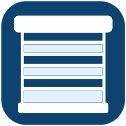

---
hide:
  - navigation
  - toc
---

{ .no-frame }

# EasyRoll Smart Blind Guide

Raise and lower from your smartphone, or let it run automatically on schedule — welcome to EasyRoll.

[New here? Get started](easyroll/01_시작하기.md){ .md-button .md-button--primary }
[Troubleshooting FAQ](easyroll/06_문제해결_FAQ.md){ .md-button }

## Platform Integrations

- [{ .er-bicon .no-frame } **SmartThings · Bixby** Samsung SmartThings connection and voice control](st/index.md)
- [{ .er-bicon .no-frame } **Google Home** "Hey Google, open the blind"](google/index.md)
- [:simple-homeassistant:{ .icon-ha } **Home Assistant** Direct smart home connection — for advanced users](ha/index.md)

---

**Contact us** 💬

☎️ Customer Center **031-358-1016** · Weekdays 09:00 – 18:00

🌐 Website **[easyroll.kr](https://easyroll.kr)**

In the app, go to **Menu → Contact Us**.

