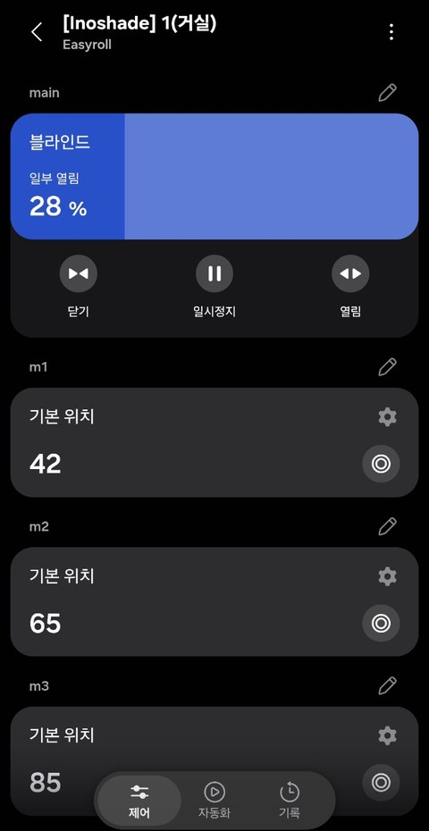
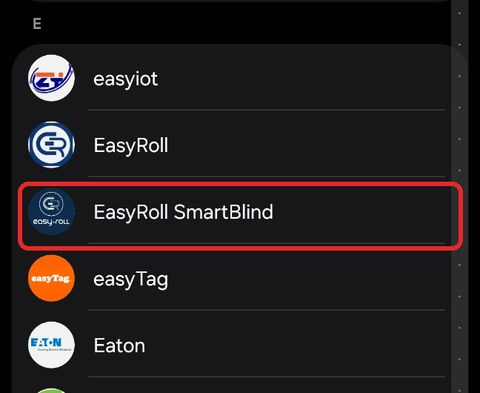
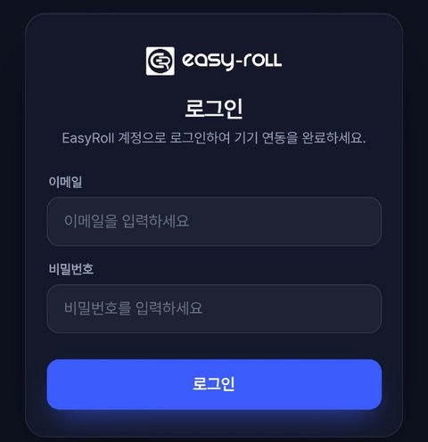
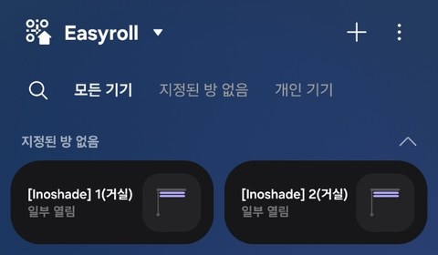

# SmartThings Integration

!!! success "Works With SmartThings certified"

    The EasyRoll Smart Blind (**EasyRoll Smartblind**) is an **officially certified partner device** that has passed Samsung's **WWST (Works With SmartThings)** certification.
    It connects right in the SmartThings app — **no separate hub needed**, just your Samsung account and EasyRoll account — and **Bixby and Routines (automations)** are fully supported.

Connect your EasyRoll Smart Blind to **Samsung SmartThings** to control it alongside your Galaxy phone and Samsung appliances **on one screen**, and operate it with **Bixby voice** as well.

---

## Features covered by the certification

| Feature | In SmartThings |
|---|---|
| **Open · Close · Stop** | **Close · Pause · Open** buttons on the device card / Bixby / Routines |
| **Position %** | Set any height with the slider (**100% = fully open, 0% = fully closed** — SmartThings convention) |
| **Preset positions m1 · m2 · m3** | Tap **◎** on the card to move to a preset height in one go; change the height with **⚙** (initially 25% / 50% / 75%) |
| **Live status** | Opening / Closing / Open / Closed / Partially open — the card **updates automatically** as the blind moves |
| **Online / Offline** | If the blind loses power or internet, SmartThings shows it as "offline" |

{ width="300" }

> 💡 In the screenshot, the m1 · m2 · m3 values **42 / 65 / 85** are examples changed with ⚙. When you first connect, they start at **25 / 50 / 75**.
>
> 💡 The SmartThings presets m1 · m2 · m3 are **separate from the M1–M3 memory positions** in the EasyRoll app. Set each up as you like.

---

## What You'll Need

- An account with **your blind registered in the EasyRoll app** ([Register Device](../easyroll/02_앱_등록하기.md) completed)
- Connect with the **account that registered (owns) the blinds** — blinds shared with you as a [member](../easyroll/10_구성원_추가.md) are not linked.
- The **SmartThings app** installed on your smartphone + signed in with your Samsung account
- The blind **connected to the internet (home Wi-Fi)** — the SmartThings integration works through the EasyRoll server

## Connecting (One-Time Setup)

1. **SmartThings app** → **[+ Add Device]** → **[Add]** under **Partner devices**

    ![Add device — [Add] under Partner devices](../images/st/st_01_add_device.jpg){ width="300" }

2. Select **EasyRoll SmartBlind** from the brand list (type "EasyRoll" in the 🔍 search box to jump straight to it)

    { width="300" }

    > ⚠️ A similarly named **EasyRoll** (the older integration) also appears in the list. For a new connection, be sure to pick **EasyRoll SmartBlind** (the certified version).

3. When the EasyRoll login page opens, **sign in with your EasyRoll app account (email and password)**

    { width="300" }

4. When your registered blinds **appear in the SmartThings [Devices] tab automatically, you're done!**

    { width="300" }

    > 💡 Blinds arrive with names in the form "[Inoshade] number(zone name)" — e.g. **"[Inoshade] 1(Living Room)"** — and are first placed under **"No room assigned"**. Use **⋮** at the top right of the device screen to give each one an easy-to-say name such as "Living Room Blind" and assign it to a room (e.g. Living Room), so **Bixby voice** and Routines recognize it more reliably.

> 💡 **All blinds registered in the EasyRoll app are added to SmartThings at once** (only blinds registered to your own account — shared blinds are not included). Blinds you register later are added to SmartThings automatically as well (this can take up to about a day).
>
> 💡 If you connected to SmartThings earlier, you can **keep using that connection as is.**

## How You Can Use It

| Method | Example |
|---|---|
| **SmartThings card** | Close/pause/open, position %, presets m1 · m2 · m3 |
| **Bixby voice** | "Hi Bixby, open the living room blind" / "Open the blind halfway" / "Close the blind" |
| **Routines (automation)** | Close the blinds in sleep mode · open them with your morning alarm · close all when leaving home · follow sunrise/sunset |
| **Together with Samsung appliances** | Close the blind when the TV turns on, block sunlight when the air conditioner starts — all in one routine |

## When Things Don't Work

| Symptom | Solution |
|---|---|
| EasyRoll SmartBlind isn't in the list | The list is alphabetical — scroll to **E** or type "EasyRoll" in the 🔍 search box → if it's still missing, update the SmartThings app to the latest version and try again |
| Connected but the device doesn't show | Check that you signed in with the **owner account** that registered the blinds (blinds shared with you as a member don't appear) → check in the EasyRoll app that the blind is properly registered and online. A newly registered blind can take **up to about a day** to appear in SmartThings |
| Card controls don't respond | Check that the blind is online ([FAQ](../easyroll/06_문제해결_FAQ.md)) → disconnect the SmartThings link and reconnect |
| The position % in SmartThings differs from the app | SmartThings uses the same convention as the EasyRoll app (**100% = fully open**), so the values should match. Wait a moment after the blind stops or refresh the device screen; if it still differs, check the upper/lower limits, then unlink and link SmartThings again |
| Slider only does 0/100 | The blind's **upper/lower limits** aren't set → [2-1. Upper/Lower Limit Setup](../easyroll/02-1_상하단_위치_설정.md) |

---

:material-phone-in-talk: **Customer Center** 031-358-1016 · Weekdays 09:00 – 18:00

:material-web: **Website** [easyroll.kr](https://easyroll.kr) · Community → Q&A board

